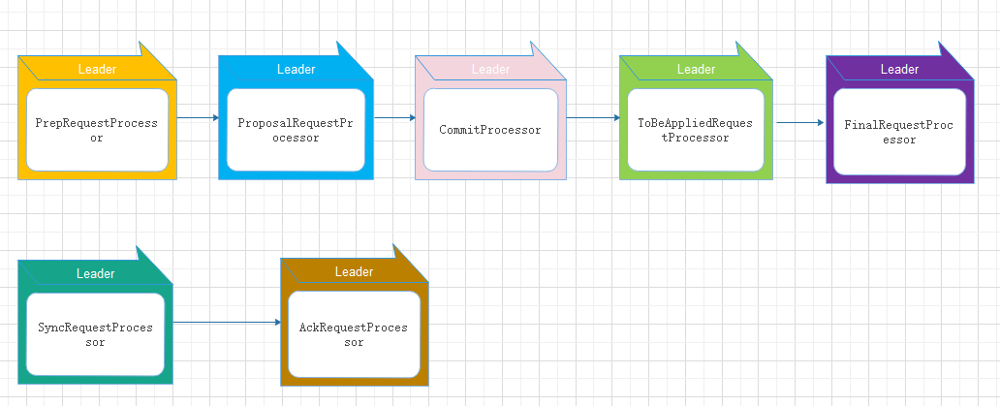

## **单机版服务端启动**


#### （1）统一由QuorumPeerMain作为启动类。
   无论是单机版还是集群版，在启动ZooKeeper服务器时，在zkServer.cmd和zkServer.sh两个脚本中，都配置了使用org.apach.zookeeper.server.quorum.QuorumPeerMain作为启动类入口。

```
 public static void main(String[] args) {
        QuorumPeerMain main = new QuorumPeerMain();
        main.initializeAndRun(args);
        LOG.info("Exiting normally");
        System.exit(0);
    }
 
 // 初始化运行
protected void initializeAndRun(String[] args)
            throws ConfigException, IOException {
        QuorumPeerConfig config = new QuorumPeerConfig();
        if (args.length == 1) {
            System.out.println(args[0]);
            config.parse(args[0]);
        }

        // Start and schedule the the purge task
        DatadirCleanupManager purgeMgr = new          DatadirCleanupManager(config
                .getDataDir(), config.getDataLogDir(), config
                .getSnapRetainCount(), config.getPurgeInterval());
        purgeMgr.start();

        if (args.length == 1 && config.servers.size() > 0) {
            runFromConfig(config);
        } else {
            LOG.warn("Either no config or no quorum defined in config, running "
                    + " in standalone mode");
            // there is only server in the quorum -- run as standalone
            ZooKeeperServerMain.main(args);
        }
    }
```


#### （2）解析配置文件zoo.cfg。
   ZooKeeper首先会进行配置文件的解析，配置文件的解析其实就是对zoo.cfg文件的解析，该文件配置了ZooKeeper运行时的基本参数，包括ticketTime、DataDir和clientPort等参数。


#### （3）创建并启动历史文件清理器DatadirCleanupManager。
   从3.4.0版本开始，ZooKeeper增加了自动清理历史数据文件的机制，包括对事务日志和快照文件进行定时清理。


#### （4）判断当前是集群模式还是单机模式的启动。
   从上面步骤（2）解析出的集群服务器地址列表来判断当前是集群模式还是单机模式，如果是单机模式，就委托给ZooKeeperServerMain进行启动处理。
     
```
     public static void main(String[] args) {
        ZooKeeperServerMain main = new ZooKeeperServerMain();
        main.initializeAndRun(args);
        LOG.info("Exiting normally");
        System.exit(0);
    }
    
    protected void initializeAndRun(String[] args)
        throws ConfigException, IOException{
        try {
            ManagedUtil.registerLog4jMBeans();
        } catch (JMException e) {
            LOG.warn("Unable to register log4j JMX control", e);
        }
        ServerConfig config = new ServerConfig();
        if (args.length == 1) {
            config.parse(args[0]);
        } else {
            config.parse(args);
        }
        runFromConfig(config);
    }
    
     public void runFromConfig(ServerConfig config) throws IOException {
        LOG.info("Starting server");
        FileTxnSnapLog txnLog = null;
        try {  
            //创建服务器实例ZooKeeperServer
            final ZooKeeperServer zkServer = new ZooKeeperServer(); 
            final CountDownLatch shutdownLatch = new CountDownLatch(1);
            zkServer.registerServerShutdownHandler(
                    new ZooKeeperServerShutdownHandler(shutdownLatch));
            // 创建ZooKeeper数据管理器FileTxnSnapLog
            txnLog = new FileTxnSnapLog(new File(config.dataLogDir), new File(config.dataDir));
            txnLog.setServerStats(zkServer.serverStats());
            zkServer.setTxnLogFactory(txnLog);
            zkServer.setTickTime(config.tickTime);
            zkServer.setMinSessionTimeout(config.minSessionTimeout);
            zkServer.setMaxSessionTimeout(config.maxSessionTimeout);
            //创建ServerCnxnFactory
            cnxnFactory = ServerCnxnFactory.createFactory();
            //初始化ServerCnxnFactory
            cnxnFactory.configure(config.getClientPortAddress(),
                    config.getMaxClientCnxns());
            //启动ServerCnxnFactory主线程 以及后续操作
            cnxnFactory.startup(zkServer);
            shutdownLatch.await();
            shutdown();
            cnxnFactory.join();
            if (zkServer.canShutdown()) {
                zkServer.shutdown(true);
            }
        } catch (InterruptedException e) {
            LOG.warn("Server interrupted", e);
        } finally {
            if (txnLog != null) {
                txnLog.close();
            }
        }
    }
    
    static public ServerCnxnFactory createFactory() throws IOException {
            //zookeeper.serverCnxnFactory  配置文件配置时只需要 serverCnxnFactory=
            String serverCnxnFactoryName =
                System.getProperty(ZOOKEEPER_SERVER_CNXN_FACTORY);
            if (serverCnxnFactoryName == null) {
                serverCnxnFactoryName = NIOServerCnxnFactory.class.getName();
            }
            try {
                ServerCnxnFactory serverCnxnFactory = (ServerCnxnFactory) Class.forName(serverCnxnFactoryName)
                        .getDeclaredConstructor().newInstance();
                LOG.info("Using {} as server connection factory", serverCnxnFactoryName);
                return serverCnxnFactory;
            } catch (Exception e) {
                IOException ioe = new IOException("Couldn't instantiate "
                        + serverCnxnFactoryName);
                ioe.initCause(e);
                throw ioe;
            }
        }
        
         public void configure(InetSocketAddress addr, int maxcc) throws IOException {
            configureSaslLogin();
            thread = new ZooKeeperThread(this, "NIOServerCxn.Factory:" + addr);
            thread.setDaemon(true);
            maxClientCnxns = maxcc;
            this.ss = ServerSocketChannel.open();
            ss.socket().setReuseAddress(true);
            LOG.info("binding to port " + addr);
            ss.socket().bind(addr);
            ss.configureBlocking(false);
            ss.register(selector, SelectionKey.OP_ACCEPT);
        }
        
         @Override
        public void startup(ZooKeeperServer zks) throws IOException,
                InterruptedException {
            // ZooKeeperThread 启动
            start();
            setZooKeeperServer(zks);
            // 创建内存DB 恢复本地数据        
            zks.startdata();
            // 
            zks.startup();
        }


       
       public synchronized void startup() {
     //创建并启动会话管理      if (sessionTracker == null) {
          createSessionTracker();
      }
      startSessionTracker();
      //初始化ZooKeeper的请求处理链       setupRequestProcessors();
       registerJMX();
       setState(State.RUNNING);
       notifyAll();  
       }

```


#### （5）再次进行配置文件zoo.cfg的解析。

#### （6）创建服务器实例ZooKeeperServer
   org.apach.zookeeper.server.ZooKeeperServer是单机版ZooKeeper服务端最核心的实体类。ZooKeeper服务器首先会进行服务器实例的创建，接下去的步骤是则都是对该服务器实例的初始化工作，包括连接器、内存数据库和请求处理器等组件的初始化。

#### （7）加载事务日志和快照恢复本地数据。
  每次在ZooKeeper启动的时候，都需要从本地快照文件和事务日志文件中进行数据恢复。

#### （8）创建并启动会话管理。
  在ZooKeeper启动阶段，会创建一个会话管理器SessionTracker.SessionTracker主要负责ZooKeeper服务端的会话管理。创建SessionTracker的时候，会初始化expirationInterval、nextExpirationTime和SessionWithTimeout,同时还会计算出一个初始化的sessionId。

#### （9）初始化ZooKeeper的请求处理链。
  ZooKeeper的请求处理方式是典型的责任链模式的实现，在ZooKeeper服务器上，会有多个请求处理器依次来处理一个客户端请求。在服务器启动的时候，会将这些请求处理器串联起来形成一个请求处理链。单机版服务器的请求处理链包括PrepRequestProcessor、syncRequestProcessor和FinalRequestProcessor单个请求处理器，如下如所示。

#### （10） 注册JMX服务。
  ZooKeeper会将服务器运行的一些信息以JML的方式暴露给外部。

#### （11）注册ZooKeeper服务器实例。   
  在（6）中，ZooKeeper已经将ServerCnxnFactory主线程启动，但是同时我们提到此时ZooKeeper依旧无法处理客户端请求，原因就是此时网络层尚不能够访问ZooKeeper服务器实例。在经过后续步骤的初始化后，ZooKeeper服务器实例已经初始化完毕，只需注册给ServerCnxnFactory即可，之后，ZooKeeper就可以对外提供正常服务了。


## **集群版服务端启动**


 


### **集群模式zookeeper服务启动流程**


### **二、Leader选举**

#### **2.1 Leader选举概述**

　　Leader选举是保证分布式数据一致性的关键所在。当Zookeeper集群中的一台服务器出现以下两种情况之一时，需要进入Leader选举。
　　(1) 服务器初始化启动。
　　(2) 服务器运行期间无法和Leader保持连接。

　　下面就两种情况进行分析讲解。
　　##### 1. 服务器启动时期的Leader选举
　　若进行Leader选举，则至少需要两台机器，这里选取3台机器组成的服务器集群为例。在集群初始化阶段，当有一台服务器Server1启动时，其单独无法进行和完成Leader选举，当第二台服务器Server2启动时，此时两台机器可以相互通信，每台机器都试图找到Leader，于是进入Leader选举过程。选举过程如下
　　(1) 每个Server发出一个投票。由于是初始情况，Server1和Server2都会将自己作为Leader服务器来进行投票，每次投票会包含所推举的服务器的myid和ZXID，使用(myid, ZXID)来表示，此时Server1的投票为(1, 0)，Server2的投票为(2, 0)，然后各自将这个投票发给集群中其他机器。
　　(2) 接受来自各个服务器的投票。集群的每个服务器收到投票后，首先判断该投票的有效性，如检查是否是本轮投票、是否来自LOOKING状态的服务器。
　　(3) 处理投票。针对每一个投票，服务器都需要将别人的投票和自己的投票进行PK，PK规则如下
　　
　　　　· 优先检查ZXID。ZXID比较大的服务器优先作为Leader。

　　　　· 如果ZXID相同，那么就比较myid。myid较大的服务器作为Leader服务器。

　　对于Server1而言，它的投票是(1, 0)，接收Server2的投票为(2, 0)，首先会比较两者的ZXID，均为0，再比较myid，此时Server2的myid最大，于是更新自己的投票为(2, 0)，然后重新投票，对于Server2而言，其无须更新自己的投票，只是再次向集群中所有机器发出上一次投票信息即可。

　　(4) 统计投票。每次投票后，服务器都会统计投票信息，判断是否已经有过半机器接受到相同的投票信息，对于Server1、Server2而言，都统计出集群中已经有两台机器接受了(2, 0)的投票信息，此时便认为已经选出了Leader。

　　(5) 改变服务器状态。一旦确定了Leader，每个服务器就会更新自己的状态，如果是Follower，那么就变更为FOLLOWING，如果是Leader，就变更为LEADING。

　　##### 2. 服务器运行时期的Leader选举
　　在Zookeeper运行期间，Leader与非Leader服务器各司其职，即便当有非Leader服务器宕机或新加入，此时也不会影响Leader，但是一旦Leader服务器挂了，那么整个集群将暂停对外服务，进入新一轮Leader选举，其过程和启动时期的Leader选举过程基本一致。假设正在运行的有Server1、Server2、Server3三台服务器，当前Leader是Server2，若某一时刻Leader挂了，此时便开始Leader选举。选举过程如下
　　
　　(1) 变更状态。Leader挂后，余下的非Observer服务器都会讲自己的服务器状态变更为LOOKING，然后开始进入Leader选举过程。
　　
　　(2) 每个Server会发出一个投票。在运行期间，每个服务器上的ZXID可能不同，此时假定Server1的ZXID为123，Server3的ZXID为122；在第一轮投票中，Server1和Server3都会投自己，产生投票(1, 123)，(3, 122)，然后各自将投票发送给集群中所有机器。
　　
　　(3) 接收来自各个服务器的投票。与启动时过程相同。
　　
　　(4) 处理投票。与启动时过程相同，此时，Server1将会成为Leader。
　　
　　(5) 统计投票。与启动时过程相同。
　　
　　(6) 改变服务器的状态。与启动时过程相同。
　　
　　#### 2.2 Leader选举算法分析

　　在3.4.0后的Zookeeper的版本只保留了TCP版本的FastLeaderElection选举算法。当一台机器进入Leader选举时，当前集群可能会处于以下两种状态

　　　　· 集群中已经存在Leader。

　　　　· 集群中不存在Leader。

　　对于集群中已经存在Leader而言，此种情况一般都是某台机器启动得较晚，在其启动之前，集群已经在正常工作，对这种情况，该机器试图去选举Leader时，会被告知当前服务器的Leader信息，对于该机器而言，仅仅需要和Leader机器建立起连接，并进行状态同步即可。而在集群中不存在Leader情况下则会相对复杂，其步骤如下

##### (1) 第一次投票。
   无论哪种导致进行Leader选举，集群的所有机器都处于试图选举出一个Leader的状态，即LOOKING状态，LOOKING机器会向所有其他机器发送消息，该消息称为投票。投票中包含了SID（服务器的唯一标识）和ZXID（事务ID），(SID, ZXID)形式来标识一次投票信息。假定Zookeeper由5台机器组成，SID分别为1、2、3、4、5，ZXID分别为9、9、9、8、8，并且此时SID为2的机器是Leader机器，某一时刻，1、2所在机器出现故障，因此集群开始进行Leader选举。在第一次投票时，每台机器都会将自己作为投票对象，于是SID为3、4、5的机器投票情况分别为(3, 9)，(4, 8)， (5, 8)。


##### (2) 变更投票。
　　每台机器发出投票后，也会收到其他机器的投票，每台机器会根据一定规则来处理收到的其他机器的投票，并以此来决定是否需要变更自己的投票，这个规则也是整个Leader选举算法的核心所在，其中术语描述如下

　　　　· vote_sid：接收到的投票中所推举Leader服务器的SID。

　　　　· vote_zxid：接收到的投票中所推举Leader服务器的ZXID。

　　　　· self_sid：当前服务器自己的SID。

　　　　· self_zxid：当前服务器自己的ZXID。

　　每次对收到的投票的处理，都是对(vote_sid, vote_zxid)和(self_sid, self_zxid)对比的过程。

　　　　规则一：如果vote_zxid大于self_zxid，就认可当前收到的投票，并再次将该投票发送出去。

　　　　规则二：如果vote_zxid小于self_zxid，那么坚持自己的投票，不做任何变更。

　　　　规则三：如果vote_zxid等于self_zxid，那么就对比两者的SID，如果vote_sid大于self_sid，那么就认可当前收到的投票，并再次将该投票发送出去。

　　　　规则四：如果vote_zxid等于self_zxid，并且vote_sid小于self_sid，那么坚持自己的投票，不做任何变更。

　　结合上面规则，给出下面的集群变更过程。


##### (3) 确定Leader。
   经过第二轮投票后，集群中的每台机器都会再次接收到其他机器的投票，然后开始统计投票，如果一台机器收到了超过半数的相同投票，那么这个投票对应的SID机器即为Leader。此时Server3将成为Leader。

　　由上面规则可知，通常那台服务器上的数据越新（ZXID会越大），其成为Leader的可能性越大，也就越能够保证数据的恢复。如果ZXID相同，则SID越大机会越大。

#### **2.3 Leader选举实现细节**

##### **1. 服务器状态**

　　服务器具有四种状态，分别是LOOKING、FOLLOWING、LEADING、OBSERVING。

　　LOOKING：寻找Leader状态。当服务器处于该状态时，它会认为当前集群中没有Leader，因此需要进入Leader选举状态。

　　FOLLOWING：跟随者状态。表明当前服务器角色是Follower。

　　LEADING：领导者状态。表明当前服务器角色是Leader。

　　OBSERVING：观察者状态。表明当前服务器角色是Observer。

##### 2. 投票数据结构

　　每个投票中包含了两个最基本的信息，所推举服务器的SID和ZXID，投票（Vote）在Zookeeper中包含字段如下

　　id：被推举的Leader的SID。

　　zxid：被推举的Leader事务ID。

　　electionEpoch：逻辑时钟，用来判断多个投票是否在同一轮选举周期中，该值在服务端是一个自增序列，每次进入新一轮的投票后，都会对该值进行加1操作。

　　peerEpoch：被推举的Leader的epoch。

　　state：当前服务器的状态。

##### 3. QuorumCnxManager：网络I/O

　　每台服务器在启动的过程中，会启动一个QuorumPeerManager，负责各台服务器之间的底层Leader选举过程中的网络通信。

　　(1) 消息队列。QuorumCnxManager内部维护了一系列的队列，用来保存接收到的、待发送的消息以及消息的发送器，除接收队列以外，其他队列都按照SID分组形成队列集合，如一个集群中除了自身还有3台机器，那么就会为这3台机器分别创建一个发送队列，互不干扰。

　　　　· recvQueue：消息接收队列，用于存放那些从其他服务器接收到的消息。

　　　　· queueSendMap：消息发送队列，用于保存那些待发送的消息，按照SID进行分组。

　　　　· senderWorkerMap：发送器集合，每个SenderWorker消息发送器，都对应一台远程Zookeeper服务器，负责消息的发送，也按照SID进行分组。

　　　　· lastMessageSent：最近发送过的消息，为每个SID保留最近发送过的一个消息。

　　(2) 建立连接。为了能够相互投票，Zookeeper集群中的所有机器都需要两两建立起网络连接。QuorumCnxManager在启动时会创建一个ServerSocket来监听Leader选举的通信端口(默认为3888)。开启监听后，Zookeeper能够不断地接收到来自其他服务器的创建连接请求，在接收到其他服务器的TCP连接请求时，会进行处理。为了避免两台机器之间重复地创建TCP连接，Zookeeper只允许SID大的服务器主动和其他机器建立连接，否则断开连接。在接收到创建连接请求后，服务器通过对比自己和远程服务器的SID值来判断是否接收连接请求，如果当前服务器发现自己的SID更大，那么会断开当前连接，然后自己主动和远程服务器建立连接。一旦连接建立，就会根据远程服务器的SID来创建相应的消息发送器SendWorker和消息接收器RecvWorker，并启动。

　　(3) 消息接收与发送。消息接收：由消息接收器RecvWorker负责，由于Zookeeper为每个远程服务器都分配一个单独的RecvWorker，因此，每个RecvWorker只需要不断地从这个TCP连接中读取消息，并将其保存到recvQueue队列中。消息发送：由于Zookeeper为每个远程服务器都分配一个单独的SendWorker，因此，每个SendWorker只需要不断地从对应的消息发送队列中获取出一个消息发送即可，同时将这个消息放入lastMessageSent中。在SendWorker中，一旦Zookeeper发现针对当前服务器的消息发送队列为空，那么此时需要从lastMessageSent中取出一个最近发送过的消息来进行再次发送，这是为了解决接收方在消息接收前或者接收到消息后服务器挂了，导致消息尚未被正确处理。同时，Zookeeper能够保证接收方在处理消息时，会对重复消息进行正确的处理。

##### 4. FastLeaderElection：选举算法核心

　　· 外部投票：特指其他服务器发来的投票。

　　· 内部投票：服务器自身当前的投票。

　　· 选举轮次：Zookeeper服务器Leader选举的轮次，即logicalclock。

　　· PK：对内部投票和外部投票进行对比来确定是否需要变更内部投票。

　　(1) 选票管理

　　· sendqueue：选票发送队列，用于保存待发送的选票。

　　· recvqueue：选票接收队列，用于保存接收到的外部投票。

　　· WorkerReceiver：选票接收器。其会不断地从QuorumCnxManager中获取其他服务器发来的选举消息，并将其转换成一个选票，然后保存到recvqueue中，在选票接收过程中，如果发现该外部选票的选举轮次小于当前服务器的，那么忽略该外部投票，同时立即发送自己的内部投票。
· WorkerSender：选票发送器，不断地从sendqueue中获取待发送的选票，并将其传递到底层QuorumCnxManager中。


上图展示了FastLeaderElection模块是如何与底层网络I/O进行交互的。Leader选举的基本流程如下

  1. 自增选举轮次。Zookeeper规定所有有效的投票都必须在同一轮次中，在开始新一轮投票时，会首先对logicalclock进行自增操作。

  2. 初始化选票。在开始进行新一轮投票之前，每个服务器都会初始化自身的选票，并且在初始化阶段，每台服务器都会将自己推举为Leader。

  3. 发送初始化选票。完成选票的初始化后，服务器就会发起第一次投票。Zookeeper会将刚刚初始化好的选票放入sendqueue中，由发送器WorkerSender负责发送出去。

  4. 接收外部投票。每台服务器会不断地从recvqueue队列中获取外部选票。如果服务器发现无法获取到任何外部投票，那么就会立即确认自己是否和集群中其他服务器保持着有效的连接，如果没有连接，则马上建立连接，如果已经建立了连接，则再次发送自己当前的内部投票。

 5. 判断选举轮次。在发送完初始化选票之后，接着开始处理外部投票。在处理外部投票时，会根据选举轮次来进行不同的处理。

　　　　· 外部投票的选举轮次大于内部投票。若服务器自身的选举轮次落后于该外部投票对应服务器的选举轮次，那么就会立即更新自己的选举轮次(logicalclock)，并且清空所有已经收到的投票，然后使用初始化的投票来进行PK以确定是否变更内部投票。最终再将内部投票发送出去。

　　　　· 外部投票的选举轮次小于内部投票。若服务器接收的外选票的选举轮次落后于自身的选举轮次，那么Zookeeper就会直接忽略该外部投票，不做任何处理，并返回步骤4。

　　　　· 外部投票的选举轮次等于内部投票。此时可以开始进行选票PK。

6. 选票PK。在进行选票PK时，符合任意一个条件就需要变更投票。

　　　　· 若外部投票中推举的Leader服务器的选举轮次大于内部投票，那么需要变更投票。

　　　　· 若选举轮次一致，那么就对比两者的ZXID，若外部投票的ZXID大，那么需要变更投票。

　　　　· 若两者的ZXID一致，那么就对比两者的SID，若外部投票的SID大，那么就需要变更投票。

7. 变更投票。经过PK后，若确定了外部投票优于内部投票，那么就变更投票，即使用外部投票的选票信息来覆盖内部投票，变更完成后，再次将这个变更后的内部投票发送出去。

8. 选票归档。无论是否变更了投票，都会将刚刚收到的那份外部投票放入选票集合recvset中进行归档。recvset用于记录当前服务器在本轮次的Leader选举中收到的所有外部投票（按照服务队的SID区别，如{(1, vote1), (2, vote2)...}）。

9. 统计投票。完成选票归档后，就可以开始统计投票，统计投票是为了统计集群中是否已经有过半的服务器认可了当前的内部投票，如果确定已经有过半服务器认可了该投票，则终止投票。否则返回步骤4。

10. 更新服务器状态。若已经确定可以终止投票，那么就开始更新服务器状态，服务器首选判断当前被过半服务器认可的投票所对应的Leader服务器是否是自己，若是自己，则将自己的服务器状态更新为LEADING，若不是，则根据具体情况来确定自己是FOLLOWING或是OBSERVING。

　　以上10个步骤就是FastLeaderElection的核心，其中步骤4-9会经过几轮循环，直到有Leader选举产生。

三、总结
选举轮次，也就是逻辑时钟，即logicalclock。这个值，不会频繁变化，一次选举，自增一次。一次选举过程中，可能包括多次投票，投票不涉及逻辑时钟的自增。
    
举例，初始情况下5台机器，sid分别为1、2、3、4、5，逻辑时钟都是0。依次启动后，开始选举，所有的机器逻辑时钟自增为1。经过多次投票，假设第三台机器为leader，其他4台机器为follower，此时5台机器的逻辑时钟都为1。
    
  一般情况下，逻辑时钟应该都是相同的。但是，由于一些机器崩溃的问题，是可能出现逻辑时钟不一致的情况的。例如，上例中，sid=3的机器为leader。之后某一刻，sid为1、3的机器崩溃，zookeeper仍然可以正常对外提供服务。但需要重新选主，剩下的2、4、5重新投票选主，假设sid=5成为新的leader，逻辑时钟自增，由1变成2。之后某一刻，sid为5的机器奔溃，sid为1的机器复活，仍然有3台机器运行，zookeeper可以对外提供服务，但需要重新选主。重新选主，逻辑时钟自增，这时sid为2、4的机器的逻辑时钟是由2自增为3，而sid为1的机器的逻辑时钟是由1自增为2。这种情况下，就出现了逻辑时钟不一致的情况。这时，需要清楚sid为1的机器内部的投票数据，因为这些投票数据都是过时的数据。


### zookeeper 服务端各角色的处理

#### Leader 处理链



```
 @Override
    protected void setupRequestProcessors() {
        RequestProcessor finalProcessor = new FinalRequestProcessor(this);
        RequestProcessor toBeAppliedProcessor = new Leader.ToBeAppliedRequestProcessor(
                finalProcessor, getLeader().toBeApplied);
        commitProcessor = new CommitProcessor(toBeAppliedProcessor,
                Long.toString(getServerId()), false,
                getZooKeeperServerListener());
        // 启动一次
        commitProcessor.start();
        ProposalRequestProcessor proposalProcessor = new ProposalRequestProcessor(this,
                commitProcessor);
        //启动一次
        proposalProcessor.initialize();
        firstProcessor = new PrepRequestProcessor(this, proposalProcessor);
        // 启动一次
        ((PrepRequestProcessor)firstProcessor).start();
    }
    
    // ProposalRequestProcessor构造函数
    public ProposalRequestProcessor(LeaderZooKeeperServer zks,
            RequestProcessor nextProcessor) {
        this.zks = zks;
        this.nextProcessor = nextProcessor;
        AckRequestProcessor ackProcessor = new AckRequestProcessor(zks.getLeader());
        syncProcessor = new SyncRequestProcessor(zks, ackProcessor);
    }
    // 启动另外一条执行链
    public void initialize() {
        syncProcessor.start();
    }

```


#### Follower 处理链


```
   @Override
    protected void setupRequestProcessors() {
        RequestProcessor finalProcessor = new FinalRequestProcessor(this);
        commitProcessor = new CommitProcessor(finalProcessor,
                Long.toString(getServerId()), true,
                getZooKeeperServerListener());
        commitProcessor.start();
        firstProcessor = new FollowerRequestProcessor(this, commitProcessor);
        ((FollowerRequestProcessor) firstProcessor).start();
        syncProcessor = new SyncRequestProcessor(this,
                new SendAckRequestProcessor((Learner)getFollower()));
        syncProcessor.start();
    }
```

#### Observer 处理链


```
 @Override
    protected void setupRequestProcessors() {      
        // We might consider changing the processor behaviour of 
        // Observers to, for example, remove the disk sync requirements.
        // Currently, they behave almost exactly the same as followers.
        RequestProcessor finalProcessor = new FinalRequestProcessor(this);
        commitProcessor = new CommitProcessor(finalProcessor,
                Long.toString(getServerId()), true,
                getZooKeeperServerListener());
        commitProcessor.start();
        firstProcessor = new ObserverRequestProcessor(this, commitProcessor);
        ((ObserverRequestProcessor) firstProcessor).start();

        /*
         * Observer should write to disk, so that the it won't request
         * too old txn from the leader which may lead to 
         * getting an entire snapshot.
         *
         * However, this may degrade performance as it has to write to disk
         * and do periodic snapshot which may double the memory requirements
         */
        if (syncRequestProcessorEnabled) {
            syncProcessor = new SyncRequestProcessor(this, null);
            syncProcessor.start();
        }
    }
```

##### PrepRequestProcessor的处理流程：
处理器主要功能是对请求进行预处理， 将client向server请求二进制数据反序列化成sever中请求操作

PrepRequestProcessor做为leader的第一个处理器，它的请求数据来源主要来自：

(1)    Leader做一个zk服务接收客户端请求提交到PrepRequestProcessor的队列中

(2)    作为集群的leader，在LearnerHanler.run方法中接收learner向leader发送的投票请求，消息类型为Leader.REQUEST

(1)    对于非事物性请求：sync,exists, getData, getChildRen,ping, setWatches 这里只做session的检查看看是否超时

(2)    对于事务请求：create, delete,setData,setAcl,check,multi,根据请求的类型创建不同的操作如：type=create  CreateRequest, type=delete DeleteRequest  等等

(3)    Zookeeper创建新的事务号zxid

(4)    创建并设置事务请求的消息头

(5)    反序列化网络client请求对象提取数据到事务对象的消息体中

(6)   调下一个Processor

###### ProposalRequestProcessor处理流程:
ProposalRequestProcessor的处理逻辑相对比较简单

(1)    转发到后面的处理器

(2)    如果是事务性请求（请求头存在的话），leader向follower发起操作请求，超过一半才算成功响应客户端

(3)    如果是事务性请求，调用leader的同步处理器流程

##### CommitProcessor处理流程:

 这个处理器逻辑还是有点小复杂的， leader和learner都需要用到这个处理器

 对于非事务性的操作（查询，exist等）直接会把请求转到下一个处理器处理

 leader 对于事务性操作（create， setData等）请求，CommitProcessor线程任务会hold在这里，leader中ProposalRequestProcessor处理器会将请求提案发送给所有的followers, followers响应leader，然后leader中LearnerHandler会调processAck处理响应，当超过半数的时候将调CommitProcessor.commit()方法提交请求， 紧接着CommitProcessor将请求传递到下一个处理器处理

 learner对于事务性操作（create， setData等）请求CommitProcessor线程任务会hold在这里， FollowerRequestProcessor或者ObserverRequestProcessor调CommitProcessor将请求提交队列之后会立刻向leader发送事务操作提案，Follower接收到leader的commit消息或者Observer接收到leader的inform消息它们会向CommitProcessor提交请求，紧接着CommitProcessor将请求传递到下一个处理器处理

##### ToBeAppliedRequestProcessor处理流程:

(1) 将请求转发给一下个处理器，必须是FinalRequestProcessor

(2) 其实leader在走到这个处理器之前会在CommitProcessor中hod一会等到follower反馈在到这，follower反馈后leader的LearnerHandler的processAck会将请求加入toBeApplied集合，所以在这里对于事务请求一定会在toBeApplied中有对应的移除调，如果没有ConcurrentLinkedQueue直接会抛NoSuchElementException异常

##### FinalRequestProcessor处理流程:

 这个处理器是最后一个处理器，真正去执行事务操作更改datatree的数据。

1）   调底层修改数据zks.processTxn(hdr, txn)

2）   将请求加入到committedLog集合中

3）   构建请求的响应，响应客户端

```
synchronized (zks.outstandingChanges) {
            while (!zks.outstandingChanges.isEmpty()
                    && zks.outstandingChanges.get(0).zxid <= request.zxid) {
                ChangeRecord cr = zks.outstandingChanges.remove(0);
                if (cr.zxid < request.zxid) {
                    LOG.warn("Zxid outstanding "
                            + cr.zxid
                            + " is less than current " + request.zxid);
                }
                if (zks.outstandingChangesForPath.get(cr.path) == cr) {
                    zks.outstandingChangesForPath.remove(cr.path);
                }
            }
            if (request.hdr != null) {
               TxnHeader hdr = request.hdr;
               Record txn = request.txn;
                            
               rc = zks.processTxn(hdr, txn);
            }
            // do not add non quorum packets to the queue.
            if (Request.isQuorum(request.type)) {
                zks.getZKDatabase().addCommittedProposal(request);
            }
        }
```
outstandingChanges是一个事务型请求的冗余队列，一旦处理完相关的事物请求，需要将outstandingChanges的相关item删除

处理事务型请求，主要是涉及datatree的写操作

最后会将请求放入ZKDatabase的committedLog，便于集群中的其他机器快速同步

##### SyncRequestProcessor

这个处理器用来将请求记录到txLog文件中，通过批量刷盘的方式来提升io的性能，这里请求只有被写入到本地磁盘后，才会被传递到下一个处理器

如果都是读请求就没必要toFlush了，但如果是写请求，就必须把请求写入log，这个写入未必能保证真的同步到磁盘，但如果每次写请求都同步，

性能会有问题，所以从程序的设计应该能看到作者应该是处于这个考虑选择了两个时机来做这件事情

如果没有请求的时候（即较空闲的时候）

toFlush队列到了一定数量（1000），就会批量同步

可以看到的一些问题

由于要选择合适的时机flush，客户端的响应会受到影响，为什么不考虑分离磁盘同步和响应客户端？为了更严谨？

如果写多读少，写会干扰读，因为所有的写都会加入到toFlush队列，而如果toFlush队列不为空，读也会放进去，正如上面提到的，toFlush并不会立即响应

flush干了什么？怎么实现的
```
private void flush(LinkedList<Request> toFlush) throws IOException {
        if (toFlush.isEmpty())
            return;
                                                  
        zks.getZKDatabase().commit();
        while (!toFlush.isEmpty()) {
            Request i = toFlush.remove();
            nextProcessor.processRequest(i);
        }
        if (nextProcessor instanceof Flushable) {
            ((Flushable)nextProcessor).flush();
        }
    }
```
同步磁盘zks.getZKDatabase().commit()

调用nextProcessor的方法响应网络请求，

     通常情况下nextProcessor是FinalRequestProcessor且与Flushable没有关系

     所以只需关注FinalRequestProcessor.processRequest方法，下面会提到
zks.getZKDatabase().commit()实际调用了FileTxnLog.commit，代码如下

```
public synchronized void commit() throws IOException {
       if (logStream != null) {
           logStream.flush();
       }
       for (FileOutputStream log : streamsToFlush) {
           log.flush();
           if (forceSync) {
               long startSyncNS = System.nanoTime();
                                                         
               log.getChannel().force(false);
                                                         
               long syncElapsedMS =
                   TimeUnit.NANOSECONDS.toMillis(System.nanoTime() - startSyncNS);
               if (syncElapsedMS > fsyncWarningThresholdMS) {
                   LOG.warn("fsync-ing the write ahead log in "
                           + Thread.currentThread().getName()
                           + " took " + syncElapsedMS
                           + "ms which will adversely effect operation latency. "
                           + "See the ZooKeeper troubleshooting guide");
               }
           }
       }
       while (streamsToFlush.size() > 1) {
           streamsToFlush.removeFirst().close();
       }
   }
```
将当前流logStream flush

将之前append的流streamsToFlush逐个flush;forceSync默认为true,因此会调用log.getChannel().force同步到磁盘

完成之后，会将streamsToFlush中的流删除

上面的flush和getChannel().force的差别？

一个是应用级一个是磁盘级，当调用flush会将应用数据缓冲区中的全部提交给磁盘驱动去调度，但此时也未必全部同步到磁盘

磁盘写一般是异步的，所以后者会保证全部同步到磁盘，类似操作系统的API fsync

##### AckRequestProcessor 

负责在SyncRequestProcessor处理器完成事务日志记录后，向Proposal投票收集器发送ACK反馈，表示当前leader服务器已经完成了对该Proposal的事务日志记录

##### SendAckRequestProcessor
对于leader投票请求的发送响应