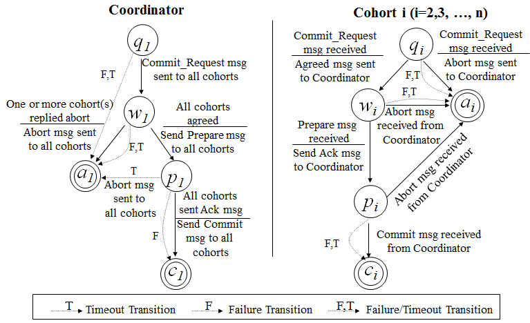
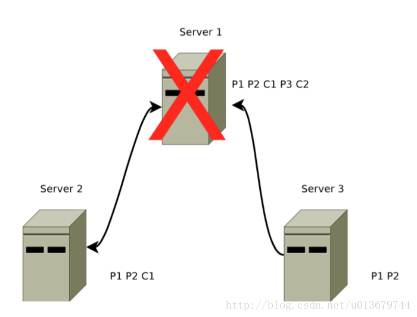

## 一.从服务端去理解

### **1.1 单机版服务端启动**


#### （1）统一由QuorumPeerMain作为启动类。
   无论是单机版还是集群版，在启动ZooKeeper服务器时，在zkServer.cmd和zkServer.sh两个脚本中，都配置了使用org.apach.zookeeper.server.quorum.QuorumPeerMain作为启动类入口。

```
 public static void main(String[] args) {
        QuorumPeerMain main = new QuorumPeerMain();
        main.initializeAndRun(args);
        LOG.info("Exiting normally");
        System.exit(0);
    }
 
 // 初始化运行
protected void initializeAndRun(String[] args)
            throws ConfigException, IOException {
        QuorumPeerConfig config = new QuorumPeerConfig();
        if (args.length == 1) {
            System.out.println(args[0]);
            config.parse(args[0]);
        }

        // Start and schedule the the purge task
        DatadirCleanupManager purgeMgr = new          DatadirCleanupManager(config
                .getDataDir(), config.getDataLogDir(), config
                .getSnapRetainCount(), config.getPurgeInterval());
        purgeMgr.start();

        if (args.length == 1 && config.servers.size() > 0) {
            runFromConfig(config);
        } else {
            LOG.warn("Either no config or no quorum defined in config, running "
                    + " in standalone mode");
            // there is only server in the quorum -- run as standalone
            ZooKeeperServerMain.main(args);
        }
    }
```


#### （2）解析配置文件zoo.cfg。
   ZooKeeper首先会进行配置文件的解析，配置文件的解析其实就是对zoo.cfg文件的解析，该文件配置了ZooKeeper运行时的基本参数，包括ticketTime、DataDir和clientPort等参数。


#### （3）创建并启动历史文件清理器DatadirCleanupManager。
   从3.4.0版本开始，ZooKeeper增加了自动清理历史数据文件的机制，包括对事务日志和快照文件进行定时清理。


#### （4）判断当前是集群模式还是单机模式的启动。
   从上面步骤（2）解析出的集群服务器地址列表来判断当前是集群模式还是单机模式，如果是单机模式，就委托给ZooKeeperServerMain进行启动处理。
     
```
     public static void main(String[] args) {
        ZooKeeperServerMain main = new ZooKeeperServerMain();
        main.initializeAndRun(args);
        LOG.info("Exiting normally");
        System.exit(0);
    }
    
    protected void initializeAndRun(String[] args)
        throws ConfigException, IOException{
        try {
            ManagedUtil.registerLog4jMBeans();
        } catch (JMException e) {
            LOG.warn("Unable to register log4j JMX control", e);
        }
        ServerConfig config = new ServerConfig();
        if (args.length == 1) {
            config.parse(args[0]);
        } else {
            config.parse(args);
        }
        runFromConfig(config);
    }
    
     public void runFromConfig(ServerConfig config) throws IOException {
        LOG.info("Starting server");
        FileTxnSnapLog txnLog = null;
        try {  
            //创建服务器实例ZooKeeperServer
            final ZooKeeperServer zkServer = new ZooKeeperServer(); 
            final CountDownLatch shutdownLatch = new CountDownLatch(1);
            zkServer.registerServerShutdownHandler(
                    new ZooKeeperServerShutdownHandler(shutdownLatch));
            // 创建ZooKeeper数据管理器FileTxnSnapLog
            txnLog = new FileTxnSnapLog(new File(config.dataLogDir), new File(config.dataDir));
            txnLog.setServerStats(zkServer.serverStats());
            zkServer.setTxnLogFactory(txnLog);
            zkServer.setTickTime(config.tickTime);
            zkServer.setMinSessionTimeout(config.minSessionTimeout);
            zkServer.setMaxSessionTimeout(config.maxSessionTimeout);
            //创建ServerCnxnFactory
            cnxnFactory = ServerCnxnFactory.createFactory();
            //初始化ServerCnxnFactory
            cnxnFactory.configure(config.getClientPortAddress(),
                    config.getMaxClientCnxns());
            //启动ServerCnxnFactory主线程 以及后续操作
            cnxnFactory.startup(zkServer);
            shutdownLatch.await();
            shutdown();
            cnxnFactory.join();
            if (zkServer.canShutdown()) {
                zkServer.shutdown(true);
            }
        } catch (InterruptedException e) {
            LOG.warn("Server interrupted", e);
        } finally {
            if (txnLog != null) {
                txnLog.close();
            }
        }
    }
    
    static public ServerCnxnFactory createFactory() throws IOException {
            //zookeeper.serverCnxnFactory  配置文件配置时只需要 serverCnxnFactory=
            String serverCnxnFactoryName =
                System.getProperty(ZOOKEEPER_SERVER_CNXN_FACTORY);
            if (serverCnxnFactoryName == null) {
                serverCnxnFactoryName = NIOServerCnxnFactory.class.getName();
            }
            try {
                ServerCnxnFactory serverCnxnFactory = (ServerCnxnFactory) Class.forName(serverCnxnFactoryName)
                        .getDeclaredConstructor().newInstance();
                LOG.info("Using {} as server connection factory", serverCnxnFactoryName);
                return serverCnxnFactory;
            } catch (Exception e) {
                IOException ioe = new IOException("Couldn't instantiate "
                        + serverCnxnFactoryName);
                ioe.initCause(e);
                throw ioe;
            }
        }
        
         public void configure(InetSocketAddress addr, int maxcc) throws IOException {
            configureSaslLogin();
            thread = new ZooKeeperThread(this, "NIOServerCxn.Factory:" + addr);
            thread.setDaemon(true);
            maxClientCnxns = maxcc;
            this.ss = ServerSocketChannel.open();
            ss.socket().setReuseAddress(true);
            LOG.info("binding to port " + addr);
            ss.socket().bind(addr);
            ss.configureBlocking(false);
            ss.register(selector, SelectionKey.OP_ACCEPT);
        }
        
         @Override
        public void startup(ZooKeeperServer zks) throws IOException,
                InterruptedException {
            // ZooKeeperThread 启动
            start();
            setZooKeeperServer(zks);
            // 创建内存DB 恢复本地数据        
            zks.startdata();
            // 
            zks.startup();
        }


       
       public synchronized void startup() {
     //创建并启动会话管理      if (sessionTracker == null) {
          createSessionTracker();
      }
      startSessionTracker();
      //初始化ZooKeeper的请求处理链       setupRequestProcessors();
       registerJMX();
       setState(State.RUNNING);
       notifyAll();  
       }

```


#### （5）再次进行配置文件zoo.cfg的解析。

#### （6）创建服务器实例ZooKeeperServer
   org.apach.zookeeper.server.ZooKeeperServer是单机版ZooKeeper服务端最核心的实体类。ZooKeeper服务器首先会进行服务器实例的创建，接下去的步骤是则都是对该服务器实例的初始化工作，包括连接器、内存数据库和请求处理器等组件的初始化。

#### （7）加载事务日志和快照恢复本地数据。
  每次在ZooKeeper启动的时候，都需要从本地快照文件和事务日志文件中进行数据恢复。

#### （8）创建并启动会话管理。
  在ZooKeeper启动阶段，会创建一个会话管理器SessionTracker.SessionTracker主要负责ZooKeeper服务端的会话管理。创建SessionTracker的时候，会初始化expirationInterval、nextExpirationTime和SessionWithTimeout,同时还会计算出一个初始化的sessionId。

#### （9）初始化ZooKeeper的请求处理链。
  ZooKeeper的请求处理方式是典型的责任链模式的实现，在ZooKeeper服务器上，会有多个请求处理器依次来处理一个客户端请求。在服务器启动的时候，会将这些请求处理器串联起来形成一个请求处理链。单机版服务器的请求处理链包括PrepRequestProcessor、syncRequestProcessor和FinalRequestProcessor单个请求处理器，如下如所示。

#### （10） 注册JMX服务。
  ZooKeeper会将服务器运行的一些信息以JML的方式暴露给外部。

#### （11）注册ZooKeeper服务器实例。   
  在（6）中，ZooKeeper已经将ServerCnxnFactory主线程启动，但是同时我们提到此时ZooKeeper依旧无法处理客户端请求，原因就是此时网络层尚不能够访问ZooKeeper服务器实例。在经过后续步骤的初始化后，ZooKeeper服务器实例已经初始化完毕，只需注册给ServerCnxnFactory即可，之后，ZooKeeper就可以对外提供正常服务了。


### **1.2 集群版服务端启动**


 


#### **1.2.1集群模式zookeeper服务启动流程**


#### **1.3 Leader选举**

#### **1.3.1  Leader选举概述**

　　Leader选举是保证分布式数据一致性的关键所在。当Zookeeper集群中的一台服务器出现以下两种情况之一时，需要进入Leader选举。
　　(1) 服务器初始化启动。
　　(2) 服务器运行期间无法和Leader保持连接。

下面分别对两种情况进行分析讲解。

　　##### 1. 服务器启动时期的Leader选举
　　若进行Leader选举，则至少需要两台机器，这里选取3台机器组成的服务器集群为例。在集群初始化阶段，当有一台服务器Server1启动时，其单独无法进行和完成Leader选举，当第二台服务器Server2启动时，此时两台机器可以相互通信，每台机器都试图找到Leader，于是进入Leader选举过程。选举过程如下

　　(1) 每个Server发出一个投票。由于是初始情况，Server1和Server2都会将自己作为Leader服务器来进行投票，每次投票会包含所推举的服务器的myid和ZXID，使用(myid, ZXID)来表示，此时Server1的投票为(1, 0)，Server2的投票为(2, 0)，然后各自将这个投票发给集群中其他机器。
　　(2) 接受来自各个服务器的投票。集群的每个服务器收到投票后，首先判断该投票的有效性，如检查是否是本轮投票、是否来自LOOKING状态的服务器。
　　(3) 处理投票。针对每一个投票，服务器都需要将别人的投票和自己的投票进行PK，PK规则如下
　　
　　　　· 优先检查ZXID。ZXID比较大的服务器优先作为Leader。

　　　　· 如果ZXID相同，那么就比较myid。myid较大的服务器作为Leader服务器。

　　对于Server1而言，它的投票是(1, 0)，接收Server2的投票为(2, 0)，首先会比较两者的ZXID，均为0，再比较myid，此时Server2的myid最大，于是更新自己的投票为(2, 0)，然后重新投票，对于Server2而言，其无须更新自己的投票，只是再次向集群中所有机器发出上一次投票信息即可。

　　(4) 统计投票。每次投票后，服务器都会统计投票信息，判断是否已经有过半机器接受到相同的投票信息，对于Server1、Server2而言，都统计出集群中已经有两台机器接受了(2, 0)的投票信息，此时便认为已经选出了Leader。

　　(5) 改变服务器状态。一旦确定了Leader，每个服务器就会更新自己的状态，如果是Follower，那么就变更为FOLLOWING，如果是Leader，就变更为LEADING。

　　##### 2. 服务器运行时期的Leader选举
　　在Zookeeper运行期间，Leader与非Leader服务器各司其职，即便当有非Leader服务器宕机或新加入，此时也不会影响Leader，但是一旦Leader服务器挂了，那么整个集群将暂停对外服务，进入新一轮Leader选举，其过程和启动时期的Leader选举过程基本一致。假设正在运行的有Server1、Server2、Server3三台服务器，当前Leader是Server2，若某一时刻Leader挂了，此时便开始Leader选举。选举过程如下
　　
　　(1) 变更状态。Leader挂后，余下的非Observer服务器都会讲自己的服务器状态变更为LOOKING，然后开始进入Leader选举过程。
　　
　　(2) 每个Server会发出一个投票。在运行期间，每个服务器上的ZXID可能不同，此时假定Server1的ZXID为123，Server3的ZXID为122；在第一轮投票中，Server1和Server3都会投自己，产生投票(1, 123)，(3, 122)，然后各自将投票发送给集群中所有机器。
　　
　　(3) 接收来自各个服务器的投票。与启动时过程相同。
　　
　　(4) 处理投票。与启动时过程相同，此时，Server1将会成为Leader。
　　
　　(5) 统计投票。与启动时过程相同。
　　
　　(6) 改变服务器的状态。与启动时过程相同。
　　
　　#### 1.3.2 Leader选举算法分析

　　在3.4.0后的Zookeeper的版本只保留了TCP版本的FastLeaderElection选举算法。当一台机器进入Leader选举时，当前集群可能会处于以下两种状态

　　　　· 集群中已经存在Leader。

　　　　· 集群中不存在Leader。

　　对于集群中已经存在Leader而言，此种情况一般都是某台机器启动得较晚，在其启动之前，集群已经在正常工作，对这种情况，该机器试图去选举Leader时，会被告知当前服务器的Leader信息，对于该机器而言，仅仅需要和Leader机器建立起连接，并进行状态同步即可。而在集群中不存在Leader情况下则会相对复杂，其步骤如下

##### (1) 第一次投票。
   无论哪种导致进行Leader选举，集群的所有机器都处于试图选举出一个Leader的状态，即LOOKING状态，LOOKING机器会向所有其他机器发送消息，该消息称为投票。投票中包含了SID（服务器的唯一标识）和ZXID（事务ID），(SID, ZXID)形式来标识一次投票信息。假定Zookeeper由5台机器组成，SID分别为1、2、3、4、5，ZXID分别为9、9、9、8、8，并且此时SID为2的机器是Leader机器，某一时刻，1、2所在机器出现故障，因此集群开始进行Leader选举。在第一次投票时，每台机器都会将自己作为投票对象，于是SID为3、4、5的机器投票情况分别为(3, 9)，(4, 8)， (5, 8)。


##### (2) 变更投票。
　　每台机器发出投票后，也会收到其他机器的投票，每台机器会根据一定规则来处理收到的其他机器的投票，并以此来决定是否需要变更自己的投票，这个规则也是整个Leader选举算法的核心所在，其中术语描述如下

　　　　· vote_sid：接收到的投票中所推举Leader服务器的SID。

　　　　· vote_zxid：接收到的投票中所推举Leader服务器的ZXID。

　　　　· self_sid：当前服务器自己的SID。

　　　　· self_zxid：当前服务器自己的ZXID。

　　每次对收到的投票的处理，都是对(vote_sid, vote_zxid)和(self_sid, self_zxid)对比的过程。

　　　　规则一：如果vote_zxid大于self_zxid，就认可当前收到的投票，并再次将该投票发送出去。

　　　　规则二：如果vote_zxid小于self_zxid，那么坚持自己的投票，不做任何变更。

　　　　规则三：如果vote_zxid等于self_zxid，那么就对比两者的SID，如果vote_sid大于self_sid，那么就认可当前收到的投票，并再次将该投票发送出去。

　　　　规则四：如果vote_zxid等于self_zxid，并且vote_sid小于self_sid，那么坚持自己的投票，不做任何变更。

　　结合上面规则，给出下面的集群变更过程。


##### (3) 确定Leader。
   经过第二轮投票后，集群中的每台机器都会再次接收到其他机器的投票，然后开始统计投票，如果一台机器收到了超过半数的相同投票，那么这个投票对应的SID机器即为Leader。此时Server3将成为Leader。

　　由上面规则可知，通常那台服务器上的数据越新（ZXID会越大），其成为Leader的可能性越大，也就越能够保证数据的恢复。如果ZXID相同，则SID越大机会越大。

#### **1.3.3 Leader选举实现细节**

##### **1. 服务器状态**

　　服务器具有四种状态，分别是LOOKING、FOLLOWING、LEADING、OBSERVING。

　　LOOKING：寻找Leader状态。当服务器处于该状态时，它会认为当前集群中没有Leader，因此需要进入Leader选举状态。

　　FOLLOWING：跟随者状态。表明当前服务器角色是Follower。

　　LEADING：领导者状态。表明当前服务器角色是Leader。

　　OBSERVING：观察者状态。表明当前服务器角色是Observer。

##### 2. 投票数据结构

　　每个投票中包含了两个最基本的信息，所推举服务器的SID和ZXID，投票（Vote）在Zookeeper中包含字段如下

　　id：被推举的Leader的SID。

　　zxid：被推举的Leader事务ID。

　　electionEpoch：逻辑时钟，用来判断多个投票是否在同一轮选举周期中，该值在服务端是一个自增序列，每次进入新一轮的投票后，都会对该值进行加1操作。

　　peerEpoch：被推举的Leader的epoch。

　　state：当前服务器的状态。

##### 3. QuorumCnxManager：网络I/O

　　每台服务器在启动的过程中，会启动一个QuorumPeerManager，负责各台服务器之间的底层Leader选举过程中的网络通信。

(1) 消息队列。QuorumCnxManager内部维护了一系列的队列，用来保存接收到的、待发送的消息以及消息的发送器，除接收队列以外，其他队列都按照SID分组形成队列集合，如一个集群中除了自身还有3台机器，那么就会为这3台机器分别创建一个发送队列，互不干扰。

　　　　· recvQueue：消息接收队列，用于存放那些从其他服务器接收到的消息。

　　　　· queueSendMap：消息发送队列，用于保存那些待发送的消息，按照SID进行分组。

　　　　· senderWorkerMap：发送器集合，每个SenderWorker消息发送器，都对应一台远程Zookeeper服务器，负责消息的发送，也按照SID进行分组。

　　　　· lastMessageSent：最近发送过的消息，为每个SID保留最近发送过的一个消息。

(2) 建立连接。为了能够相互投票，Zookeeper集群中的所有机器都需要两两建立起网络连接。QuorumCnxManager在启动时会创建一个ServerSocket来监听Leader选举的通信端口(默认为3888)。开启监听后，Zookeeper能够不断地接收到来自其他服务器的创建连接请求，在接收到其他服务器的TCP连接请求时，会进行处理。为了避免两台机器之间重复地创建TCP连接，Zookeeper只允许SID大的服务器主动和其他机器建立连接，否则断开连接。在接收到创建连接请求后，服务器通过对比自己和远程服务器的SID值来判断是否接收连接请求，如果当前服务器发现自己的SID更大，那么会断开当前连接，然后自己主动和远程服务器建立连接。一旦连接建立，就会根据远程服务器的SID来创建相应的消息发送器SendWorker和消息接收器RecvWorker，并启动。

(3) 消息接收与发送。

消息接收：由消息接收器RecvWorker负责，由于Zookeeper为每个远程服务器都分配一个单独的RecvWorker，因此，每个RecvWorker只需要不断地从这个TCP连接中读取消息，并将其保存到recvQueue队列中。

消息发送：由于Zookeeper为每个远程服务器都分配一个单独的SendWorker，因此，每个SendWorker只需要不断地从对应的消息发送队列中获取出一个消息发送即可，同时将这个消息放入lastMessageSent中。在SendWorker中，一旦Zookeeper发现针对当前服务器的消息发送队列为空，那么此时需要从lastMessageSent中取出一个最近发送过的消息来进行再次发送，这是为了解决接收方在消息接收前或者接收到消息后服务器挂了，导致消息尚未被正确处理。同时，Zookeeper能够保证接收方在处理消息时，会对重复消息进行正确的处理。

##### 4. FastLeaderElection：选举算法核心

　　· 外部投票：特指其他服务器发来的投票。

　　· 内部投票：服务器自身当前的投票。

　　· 选举轮次：Zookeeper服务器Leader选举的轮次，即logicalclock。

　　· PK：对内部投票和外部投票进行对比来确定是否需要变更内部投票。

　　(1) 选票管理

　　· sendqueue：选票发送队列，用于保存待发送的选票。

　　· recvqueue：选票接收队列，用于保存接收到的外部投票。

　　· WorkerReceiver：选票接收器。其会不断地从QuorumCnxManager中获取其他服务器发来的选举消息，并将其转换成一个选票，然后保存到recvqueue中，在选票接收过程中，如果发现该外部选票的选举轮次小于当前服务器的，那么忽略该外部投票，同时立即发送自己的内部投票。
· WorkerSender：选票发送器，不断地从sendqueue中获取待发送的选票，并将其传递到底层QuorumCnxManager中。


上图展示了FastLeaderElection模块是如何与底层网络I/O进行交互的。Leader选举的基本流程如下

  1. 自增选举轮次。Zookeeper规定所有有效的投票都必须在同一轮次中，在开始新一轮投票时，会首先对logicalclock进行自增操作。

  2. 初始化选票。在开始进行新一轮投票之前，每个服务器都会初始化自身的选票，并且在初始化阶段，每台服务器都会将自己推举为Leader。

  3. 发送初始化选票。完成选票的初始化后，服务器就会发起第一次投票。Zookeeper会将刚刚初始化好的选票放入sendqueue中，由发送器WorkerSender负责发送出去。

  4. 接收外部投票。每台服务器会不断地从recvqueue队列中获取外部选票。如果服务器发现无法获取到任何外部投票，那么就会立即确认自己是否和集群中其他服务器保持着有效的连接，如果没有连接，则马上建立连接，如果已经建立了连接，则再次发送自己当前的内部投票。

 5. 判断选举轮次。在发送完初始化选票之后，接着开始处理外部投票。在处理外部投票时，会根据选举轮次来进行不同的处理。

　　　　· 外部投票的选举轮次大于内部投票。若服务器自身的选举轮次落后于该外部投票对应服务器的选举轮次，那么就会立即更新自己的选举轮次(logicalclock)，并且清空所有已经收到的投票，然后使用初始化的投票来进行PK以确定是否变更内部投票。最终再将内部投票发送出去。

　　　　· 外部投票的选举轮次小于内部投票。若服务器接收的外选票的选举轮次落后于自身的选举轮次，那么Zookeeper就会直接忽略该外部投票，不做任何处理，并返回步骤4。

　　　　· 外部投票的选举轮次等于内部投票。此时可以开始进行选票PK。

6. 选票PK。在进行选票PK时，符合任意一个条件就需要变更投票。

　　　　· 若外部投票中推举的Leader服务器的选举轮次大于内部投票，那么需要变更投票。

　　　　· 若选举轮次一致，那么就对比两者的ZXID，若外部投票的ZXID大，那么需要变更投票。

　　　　· 若两者的ZXID一致，那么就对比两者的SID，若外部投票的SID大，那么就需要变更投票。

7. 变更投票。经过PK后，若确定了外部投票优于内部投票，那么就变更投票，即使用外部投票的选票信息来覆盖内部投票，变更完成后，再次将这个变更后的内部投票发送出去。

8. 选票归档。无论是否变更了投票，都会将刚刚收到的那份外部投票放入选票集合recvset中进行归档。recvset用于记录当前服务器在本轮次的Leader选举中收到的所有外部投票（按照服务队的SID区别，如{(1, vote1), (2, vote2)...}）。

9. 统计投票。完成选票归档后，就可以开始统计投票，统计投票是为了统计集群中是否已经有过半的服务器认可了当前的内部投票，如果确定已经有过半服务器认可了该投票，则终止投票。否则返回步骤4。

10. 更新服务器状态。若已经确定可以终止投票，那么就开始更新服务器状态，服务器首选判断当前被过半服务器认可的投票所对应的Leader服务器是否是自己，若是自己，则将自己的服务器状态更新为LEADING，若不是，则根据具体情况来确定自己是FOLLOWING或是OBSERVING。

　　以上10个步骤就是FastLeaderElection的核心，其中步骤4-9会经过几轮循环，直到有Leader选举产生。

三、总结

选举轮次，也就是逻辑时钟，即logicalclock。这个值，不会频繁变化，一次选举，自增一次。一次选举过程中，可能包括多次投票，投票不涉及逻辑时钟的自增。


举例，初始情况下5台机器，sid分别为1、2、3、4、5，逻辑时钟都是0。依次启动后，开始选举，所有的机器逻辑时钟自增为1。经过多次投票，假设第三台机器为leader，其他4台机器为follower，此时5台机器的逻辑时钟都为1。
    

  一般情况下，逻辑时钟应该都是相同的。但是，由于一些机器崩溃的问题，是可能出现逻辑时钟不一致的情况的。例如，上例中，sid=3的机器为leader。之后某一刻，sid为1、3的机器崩溃，zookeeper仍然可以正常对外提供服务。但需要重新选主，剩下的2、4、5重新投票选主，假设sid=5成为新的leader，逻辑时钟自增，由1变成2。之后某一刻，sid为5的机器奔溃，sid为1的机器复活，仍然有3台机器运行，zookeeper可以对外提供服务，但需要重新选主。重新选主，逻辑时钟自增，这时sid为2、4的机器的逻辑时钟是由2自增为3，而sid为1的机器的逻辑时钟是由1自增为2。这种情况下，就出现了逻辑时钟不一致的情况。这时，需要清楚sid为1的机器内部的投票数据，因为这些投票数据都是过时的数据。


### **1.4 zookeeper 服务端各角色的处理**

#### Leader 处理链


```
 @Override
    protected void setupRequestProcessors() {
        RequestProcessor finalProcessor = new FinalRequestProcessor(this);
        RequestProcessor toBeAppliedProcessor = new Leader.ToBeAppliedRequestProcessor(
                finalProcessor, getLeader().toBeApplied);
        commitProcessor = new CommitProcessor(toBeAppliedProcessor,
                Long.toString(getServerId()), false,
                getZooKeeperServerListener());
        // 启动一次
        commitProcessor.start();
        ProposalRequestProcessor proposalProcessor = new ProposalRequestProcessor(this,
                commitProcessor);
        //启动一次
        proposalProcessor.initialize();
        firstProcessor = new PrepRequestProcessor(this, proposalProcessor);
        // 启动一次
        ((PrepRequestProcessor)firstProcessor).start();
    }
    
    // ProposalRequestProcessor构造函数
    public ProposalRequestProcessor(LeaderZooKeeperServer zks,
            RequestProcessor nextProcessor) {
        this.zks = zks;
        this.nextProcessor = nextProcessor;
        AckRequestProcessor ackProcessor = new AckRequestProcessor(zks.getLeader());
        syncProcessor = new SyncRequestProcessor(zks, ackProcessor);
    }
    // 启动另外一条执行链
    public void initialize() {
        syncProcessor.start();
    }

```


#### Follower 处理链


```
   @Override
    protected void setupRequestProcessors() {
        RequestProcessor finalProcessor = new FinalRequestProcessor(this);
        commitProcessor = new CommitProcessor(finalProcessor,
                Long.toString(getServerId()), true,
                getZooKeeperServerListener());
        commitProcessor.start();
        firstProcessor = new FollowerRequestProcessor(this, commitProcessor);
        ((FollowerRequestProcessor) firstProcessor).start();
        syncProcessor = new SyncRequestProcessor(this,
                new SendAckRequestProcessor((Learner)getFollower()));
        syncProcessor.start();
    }
```

#### Observer 处理链


```
 @Override
    protected void setupRequestProcessors() {      
        // We might consider changing the processor behaviour of 
        // Observers to, for example, remove the disk sync requirements.
        // Currently, they behave almost exactly the same as followers.
        RequestProcessor finalProcessor = new FinalRequestProcessor(this);
        commitProcessor = new CommitProcessor(finalProcessor,
                Long.toString(getServerId()), true,
                getZooKeeperServerListener());
        commitProcessor.start();
        firstProcessor = new ObserverRequestProcessor(this, commitProcessor);
        ((ObserverRequestProcessor) firstProcessor).start();

        /*
         * Observer should write to disk, so that the it won't request
         * too old txn from the leader which may lead to 
         * getting an entire snapshot.
         *
         * However, this may degrade performance as it has to write to disk
         * and do periodic snapshot which may double the memory requirements
         */
        if (syncRequestProcessorEnabled) {
            syncProcessor = new SyncRequestProcessor(this, null);
            syncProcessor.start();
        }
    }
```

##### PrepRequestProcessor的处理流程：
处理器主要功能是对请求进行预处理， 将client向server请求二进制数据反序列化成sever中请求操作

PrepRequestProcessor做为leader的第一个处理器，它的请求数据来源主要来自：

(1)    Leader做一个zk服务接收客户端请求提交到PrepRequestProcessor的队列中

(2)    作为集群的leader，在LearnerHanler.run方法中接收learner向leader发送的投票请求，消息类型为Leader.REQUEST

(1)    对于非事物性请求：sync,exists, getData, getChildRen,ping, setWatches 这里只做session的检查看看是否超时

(2)    对于事务请求：create, delete,setData,setAcl,check,multi,根据请求的类型创建不同的操作如：type=create  CreateRequest, type=delete DeleteRequest  等等

(3)    Zookeeper创建新的事务号zxid

(4)    创建并设置事务请求的消息头

(5)    反序列化网络client请求对象提取数据到事务对象的消息体中

(6)   调下一个Processor

###### ProposalRequestProcessor处理流程:
ProposalRequestProcessor的处理逻辑相对比较简单

(1)    转发到后面的处理器

(2)    如果是事务性请求（请求头存在的话），leader向follower发起操作请求，超过一半才算成功响应客户端

(3)    如果是事务性请求，调用leader的同步处理器流程

##### CommitProcessor处理流程:

 这个处理器逻辑还是有点小复杂的， leader和learner都需要用到这个处理器

 对于非事务性的操作（查询，exist等）直接会把请求转到下一个处理器处理

 leader 对于事务性操作（create， setData等）请求，CommitProcessor线程任务会hold在这里，leader中ProposalRequestProcessor处理器会将请求提案发送给所有的followers, followers响应leader，然后leader中LearnerHandler会调processAck处理响应，当超过半数的时候将调CommitProcessor.commit()方法提交请求， 紧接着CommitProcessor将请求传递到下一个处理器处理

 learner对于事务性操作（create， setData等）请求CommitProcessor线程任务会hold在这里， FollowerRequestProcessor或者ObserverRequestProcessor调CommitProcessor将请求提交队列之后会立刻向leader发送事务操作提案，Follower接收到leader的commit消息或者Observer接收到leader的inform消息它们会向CommitProcessor提交请求，紧接着CommitProcessor将请求传递到下一个处理器处理

##### ToBeAppliedRequestProcessor处理流程:

(1) 将请求转发给一下个处理器，必须是FinalRequestProcessor

(2) 其实leader在走到这个处理器之前会在CommitProcessor中hod一会等到follower反馈在到这，follower反馈后leader的LearnerHandler的processAck会将请求加入toBeApplied集合，所以在这里对于事务请求一定会在toBeApplied中有对应的移除调，如果没有ConcurrentLinkedQueue直接会抛NoSuchElementException异常

##### FinalRequestProcessor处理流程:

 这个处理器是最后一个处理器，真正去执行事务操作更改datatree的数据。

1）   调底层修改数据zks.processTxn(hdr, txn)

2）   将请求加入到committedLog集合中

3）   构建请求的响应，响应客户端

```
synchronized (zks.outstandingChanges) {
            while (!zks.outstandingChanges.isEmpty()
                    && zks.outstandingChanges.get(0).zxid <= request.zxid) {
                ChangeRecord cr = zks.outstandingChanges.remove(0);
                if (cr.zxid < request.zxid) {
                    LOG.warn("Zxid outstanding "
                            + cr.zxid
                            + " is less than current " + request.zxid);
                }
                if (zks.outstandingChangesForPath.get(cr.path) == cr) {
                    zks.outstandingChangesForPath.remove(cr.path);
                }
            }
            if (request.hdr != null) {
               TxnHeader hdr = request.hdr;
               Record txn = request.txn;
                            
               rc = zks.processTxn(hdr, txn);
            }
            // do not add non quorum packets to the queue.
            if (Request.isQuorum(request.type)) {
                zks.getZKDatabase().addCommittedProposal(request);
            }
        }
```
outstandingChanges是一个事务型请求的冗余队列，一旦处理完相关的事物请求，需要将outstandingChanges的相关item删除

处理事务型请求，主要是涉及datatree的写操作

最后会将请求放入ZKDatabase的committedLog，便于集群中的其他机器快速同步

##### SyncRequestProcessor

这个处理器用来将请求记录到txLog文件中，通过批量刷盘的方式来提升io的性能，这里请求只有被写入到本地磁盘后，才会被传递到下一个处理器

如果都是读请求就没必要toFlush了，但如果是写请求，就必须把请求写入log，这个写入未必能保证真的同步到磁盘，但如果每次写请求都同步，

性能会有问题，所以从程序的设计应该能看到作者应该是处于这个考虑选择了两个时机来做这件事情

如果没有请求的时候（即较空闲的时候）

toFlush队列到了一定数量（1000），就会批量同步

可以看到的一些问题

由于要选择合适的时机flush，客户端的响应会受到影响，为什么不考虑分离磁盘同步和响应客户端？为了更严谨？

如果写多读少，写会干扰读，因为所有的写都会加入到toFlush队列，而如果toFlush队列不为空，读也会放进去，正如上面提到的，toFlush并不会立即响应

flush干了什么？怎么实现的
```
private void flush(LinkedList<Request> toFlush) throws IOException {
        if (toFlush.isEmpty())
            return;
                                                  
        zks.getZKDatabase().commit();
        while (!toFlush.isEmpty()) {
            Request i = toFlush.remove();
            nextProcessor.processRequest(i);
        }
        if (nextProcessor instanceof Flushable) {
            ((Flushable)nextProcessor).flush();
        }
    }
```
同步磁盘zks.getZKDatabase().commit()

调用nextProcessor的方法响应网络请求，

     通常情况下nextProcessor是FinalRequestProcessor且与Flushable没有关系

     所以只需关注FinalRequestProcessor.processRequest方法，下面会提到
zks.getZKDatabase().commit()实际调用了FileTxnLog.commit，代码如下

```
public synchronized void commit() throws IOException {
       if (logStream != null) {
           logStream.flush();
       }
       for (FileOutputStream log : streamsToFlush) {
           log.flush();
           if (forceSync) {
               long startSyncNS = System.nanoTime();
                                                         
               log.getChannel().force(false);
                                                         
               long syncElapsedMS =
                   TimeUnit.NANOSECONDS.toMillis(System.nanoTime() - startSyncNS);
               if (syncElapsedMS > fsyncWarningThresholdMS) {
                   LOG.warn("fsync-ing the write ahead log in "
                           + Thread.currentThread().getName()
                           + " took " + syncElapsedMS
                           + "ms which will adversely effect operation latency. "
                           + "See the ZooKeeper troubleshooting guide");
               }
           }
       }
       while (streamsToFlush.size() > 1) {
           streamsToFlush.removeFirst().close();
       }
   }
```
将当前流logStream flush

将之前append的流streamsToFlush逐个flush;forceSync默认为true,因此会调用log.getChannel().force同步到磁盘

完成之后，会将streamsToFlush中的流删除

上面的flush和getChannel().force的差别？

一个是应用级一个是磁盘级，当调用flush会将应用数据缓冲区中的全部提交给磁盘驱动去调度，但此时也未必全部同步到磁盘

磁盘写一般是异步的，所以后者会保证全部同步到磁盘，类似操作系统的API fsync

##### AckRequestProcessor 

负责在SyncRequestProcessor处理器完成事务日志记录后，向Proposal投票收集器发送ACK反馈，表示当前leader服务器已经完成了对该Proposal的事务日志记录

##### SendAckRequestProcessor
对于leader投票请求的发送响应

##### FollowerRequestProcessor
其用作识别当前请求是否是事务请求，若是，那么Follower就会将该请求转发给Leader服务器，Leader服务器是在接收到这个事务请求后，就会将其提交到请求处理链，按照正常事务请求进行处理。

##### SendAckRequestProcessor。
其承担了事务日志记录反馈的角色，在完成事务日志记录后，会向Leader服务器发送ACK消息以表明自身完成了事务日志的记录工作。


## **二.从客户端端去理解**

#### **客户端**
客户端是开发人员使用Zookeeper最主要的途径，很有必要弄懂客户端是如何与服务端通信的。

Zookeeper客户端主要由如下核心部件构成。

1. Zookeeper实例，客户端入口。

2. ClientWatchManager， 客户端Watcher管理器。

3. HostProvider，客户端地址列表管理器。

4. ClientCnxn，客户端核心线程，内部包含了SendThread和EventThread两个线程，SendThread为I/O线程，主要负责Zookeeper客户端和服务器之间的网络I/O通信；EventThread为事件线程，主要负责对服务端事件进行处理。


Zookeeper客户端初始化与启动环节，就是Zookeeper对象的实例化过程。客户端在初始化和启动过程中大体可以分为如下3个步骤

1. 设置默认Watcher

2. 设置Zookeeper服务器地址列表

3. 创建ClientCnxn。

若在Zookeeper构造方法中传入Watcher对象时，那么Zookeeper就会将该Watcher对象保存在ZKWatcherManager的defaultWatcher中，并作为整个客户端会话期间的默认Watcher。

```
public ZooKeeper(String connectString, int sessionTimeout, Watcher watcher,
            boolean canBeReadOnly)
        throws IOException{
        LOG.info("Initiating client connection, connectString=" + connectString + " sessionTimeout=" + sessionTimeout + " watcher=" + watcher);
        watchManager.defaultWatcher = watcher;
        ConnectStringParser connectStringParser = new ConnectStringParser(
                connectString);
        HostProvider hostProvider = new StaticHostProvider(
                connectStringParser.getServerAddresses());
        cnxn = new ClientCnxn(connectStringParser.getChrootPath(),
                hostProvider, sessionTimeout, this, watchManager,
                getClientCnxnSocket(), canBeReadOnly);
        cnxn.start();
    }
```

#### 2.1 一次会话的创建过程

下图表示了客户端与服务端会话建立的整个过程，包括初始化阶段（第一阶段）、会话创建阶段（第二阶段）、响应处理阶段（第三阶段）三个阶段。


#### 2.2 服务器地址列表
在实例化Zookeeper时，用户传入Zookeeper服务器地址列表，如192.168.0.1:2181,192.168.0.2:2181,192.168.0.3:2181，此时，Zookeeper客户端在连接服务器的过程中，是如何从这个服务器列表中选择服务器的呢？Zookeeper收到服务器地址列表后，会解析出chrootPath和保存服务器地址列表。

1. Chroot，每个客户端可以设置自己的命名空间，若客户端设置了Chroot，此时，该客户端对服务器的任何操作都将被限制在自己的命名空间下，如设置Choot为/app/X，那么该客户端的所有节点路径都是以/app/X为根节点。

2. 地址列表管理，Zookeeper使用StaticHostProvider打散服务器地址（shuffle），并将服务器地址形成一个环形循环队列，然后再依次取出服务器地址。


```
public StaticHostProvider(Collection<InetSocketAddress> serverAddresses) {
        this.resolver = new Resolver() {
            @Override
            public InetAddress[] getAllByName(String name) throws UnknownHostException {
                return InetAddress.getAllByName(name);
            }
        };
        init(serverAddresses);
    }
    
    private void init(Collection<InetSocketAddress> serverAddresses) {
        if (serverAddresses.isEmpty()) {
            throw new IllegalArgumentException(
                    "A HostProvider may not be empty!");
        }

        this.serverAddresses.addAll(serverAddresses);
        // 打散排序
        Collections.shuffle(this.serverAddresses);
    }
```


#### 2.3 ClientCnxn：网络I/O
ClientCnxn是Zookeeper客户端中负责维护客户端与服务端之间的网络连接并进行一系列网络通信的核心工作类，Packet是ClientCnxn内部定义的一个堆协议层的封装，用作Zookeeper中请求和响应的载体。Packet包含了请求头（requestHeader）、响应头（replyHeader）、请求体（request）、响应体（response）、节点路径（clientPath/serverPath）、注册的Watcher（watchRegistration）等信息，然而，并非Packet中所有的属性都在客户端与服务端之间进行网络传输，只会将requestHeader、request、readOnly三个属性序列化，并生成可用于底层网络传输的ByteBuffer，其他属性都保存在客户端的上下文中，不会进行与服务端之间的网络传输。

ClientCnxn维护着 **outgoingQueue**（客户端的请求发送队列 )和 **pendingQueue**（服务端响应的等待队列），outgoingQueue专门用于存储那些需要发送到服务端的Packet集合，pendingQueue用于存储那些已经从客户端发送到服务端的，但是需要等待服务端响应的Packet集合。

在正常情况下，会从outgoingQueue中取出一个可发送的Packet对象，同时生成一个客户端请求序号XID并将其设置到Packet请求头中去，然后序列化后再发送，请求发送完毕后，会立即将该Packet保存到pendingQueue中，以便等待服务端响应返回后进行相应的处理。


客户端获取到来自服务端的完整响应数据后，根据不同的客户端请求类型，会进行不同的处理。

1. 若检测到此时客户端尚未进行初始化，那么说明当前客户端与服务端之间正在进行会话创建，直接将接收的ByteBuffer序列化成ConnectResponse对象。

2. 若当前客户端已经处于正常会话周期，并且接收到服务端响应是一个事件，那么将接收的ByteBuffer序列化成WatcherEvent对象，并将该事件放入待处理队列中。

3. 若是一个常规请求（Create、GetData、Exist等），那么从pendingQueue队列中取出一个Packet来进行相应处理。首先会检验响应中的XID来确保请求处理的顺序性，然后再将接收到的ByteBuffer序列化成Response对象。


```
void doIO(List<Packet> pendingQueue, LinkedList<Packet> outgoingQueue, ClientCnxn cnxn)
      throws InterruptedException, IOException {
        SocketChannel sock = (SocketChannel) sockKey.channel();
        if (sock == null) {
            throw new IOException("Socket is null!");
        }
        if (sockKey.isReadable()) {
            int rc = sock.read(incomingBuffer);
            if (rc < 0) {
                throw new EndOfStreamException(
                        "Unable to read additional data from server sessionid 0x"
                                + Long.toHexString(sessionId)
                                + ", likely server has closed socket");
            }           
            if (!incomingBuffer.hasRemaining()) {
                incomingBuffer.flip();
                if (incomingBuffer == lenBuffer) {
                    recvCount++;
                    readLength();
                } else if (!initialized) {
                    // 未初始化 表示首次连接成功
                    readConnectResult();
                    enableRead();
                    if (findSendablePacket(outgoingQueue,
                            cnxn.sendThread.clientTunneledAuthenticationInProgress()) != null) {         
                        enableWrite();
                    }
                    lenBuffer.clear();
                    incomingBuffer = lenBuffer;
                    updateLastHeard();
                    initialized = true;
                } else {
                    // 处理响应信息
                    sendThread.readResponse(incomingBuffer);
                    lenBuffer.clear();
                    incomingBuffer = lenBuffer;
                    updateLastHeard();
                }
            }
        }
        if (sockKey.isWritable()) {
            synchronized(outgoingQueue) {
                Packet p = findSendablePacket(outgoingQueue,
                        cnxn.sendThread.clientTunneledAuthenticationInProgress());

                if (p != null) {
                    updateLastSend();
                    if (p.bb == null) {
                        if ((p.requestHeader != null) &&
                                (p.requestHeader.getType() != OpCode.ping) &&
                                (p.requestHeader.getType() != OpCode.auth)) {
                            p.requestHeader.setXid(cnxn.getXid());
                        }
                        p.createBB();
                    }
                    sock.write(p.bb);
                    if (!p.bb.hasRemaining()) {
                        sentCount++;
                        outgoingQueue.removeFirstOccurrence(p);
                        if (p.requestHeader != null
                                && p.requestHeader.getType() != OpCode.ping
                                && p.requestHeader.getType() != OpCode.auth) {
                            synchronized (pendingQueue) {
                                pendingQueue.add(p);
                            }
                        }
                    }
                }
                if (outgoingQueue.isEmpty()) {                
                    disableWrite();
                } else if (!initialized && p != null && !p.bb.hasRemaining()) { 
                    disableWrite();
                } else {
                    enableWrite();
                }
            }
        }
    }
    
    
    
    void readResponse(ByteBuffer incomingBuffer) throws IOException {
            ByteBufferInputStream bbis = new ByteBufferInputStream(
                    incomingBuffer);
            BinaryInputArchive bbia = BinaryInputArchive.getArchive(bbis);
            ReplyHeader replyHdr = new ReplyHeader();

            replyHdr.deserialize(bbia, "header");
            if (replyHdr.getXid() == -2) {
                // -2 is the xid for pings
                if (LOG.isDebugEnabled()) {
                    LOG.debug("Got ping response for sessionid: 0x"
                            + Long.toHexString(sessionId)
                            + " after "
                            + ((System.nanoTime() - lastPingSentNs) / 1000000)
                            + "ms");
                }
                return;
            }
            if (replyHdr.getXid() == -4) {
                // -4 is the xid for AuthPacket               
                if (replyHdr.getErr() == KeeperException.Code.AUTHFAILED.intValue()) {
                    state = States.AUTH_FAILED;
                    eventThread.queueEvent(new WatchedEvent(Watcher.Event.EventType.None,
                            Watcher.Event.KeeperState.AuthFailed, null));
                }
                if (LOG.isDebugEnabled()) {
                    LOG.debug("Got auth sessionid:0x"
                            + Long.toHexString(sessionId));
                }
                return;
            }
            if (replyHdr.getXid() == -1) {
                // -1 means notification
                if (LOG.isDebugEnabled()) {
                    LOG.debug("Got notification sessionid:0x"
                            + Long.toHexString(sessionId));
                }
                WatcherEvent event = new WatcherEvent();
                event.deserialize(bbia, "response");

                // convert from a server path to a client path
                if (chrootPath != null) {
                    String serverPath = event.getPath();
                    if (serverPath.compareTo(chrootPath) == 0)
                        event.setPath("/");
                    else if (serverPath.length() > chrootPath.length())
                        event.setPath(serverPath.substring(chrootPath.length()));
                    else {
                        LOG.warn("Got server path " + event.getPath()
                                + " which is too short for chroot path "
                                + chrootPath);
                    }
                }

                WatchedEvent we = new WatchedEvent(event);
                if (LOG.isDebugEnabled()) {
                    LOG.debug("Got " + we + " for sessionid 0x"
                            + Long.toHexString(sessionId));
                }

                eventThread.queueEvent(we);
                return;
            }
            
            if (clientTunneledAuthenticationInProgress()) {
                GetSASLRequest request = new GetSASLRequest();
                request.deserialize(bbia, "token");
                zooKeeperSaslClient.respondToServer(request.getToken(),
                        ClientCnxn.this);
                return;
            }

            Packet packet;
            synchronized (pendingQueue) {
                if (pendingQueue.size() == 0) {
                    throw new IOException("Nothing in the queue, but got "
                            + replyHdr.getXid());
                }
                packet = pendingQueue.remove();
            }
           
            try {
                if (packet.requestHeader.getXid() != replyHdr.getXid()) {
                    packet.replyHeader.setErr(
                            KeeperException.Code.CONNECTIONLOSS.intValue());
                    throw new IOException("Xid out of order. Got Xid "
                            + replyHdr.getXid() + " with err " +
                            +replyHdr.getErr() +
                            " expected Xid "
                            + packet.requestHeader.getXid()
                            + " for a packet with details: "
                            + packet);
                }

                packet.replyHeader.setXid(replyHdr.getXid());
                packet.replyHeader.setErr(replyHdr.getErr());
                packet.replyHeader.setZxid(replyHdr.getZxid());
                if (replyHdr.getZxid() > 0) {
                    lastZxid = replyHdr.getZxid();
                }
                if (packet.response != null && replyHdr.getErr() == 0) {
                    packet.response.deserialize(bbia, "response");
                }

                if (LOG.isDebugEnabled()) {
                    LOG.debug("Reading reply sessionid:0x"
                            + Long.toHexString(sessionId) + ", packet:: " + packet);
                }
            } finally {               
                finishPacket(packet);
            }
        }
        
    private void finishPacket(Packet p) {
        if (p.watchRegistration != null) {
            p.watchRegistration.register(p.replyHeader.getErr());
        }
        // 如果是非异步直接返回
        if (p.cb == null) {
            synchronized (p) {
                p.finished = true;
                p.notifyAll();
            }
        } else {
            // 异步添加到事件队列中
            p.finished = true;
            System.out.println("------------->" + p.response.toString());
            eventThread.queuePacket(p);
        }
    }
    
```

SendThread是客户端ClientCnxn内部的一个核心I/O调度线程，用于管理客户端与服务端之间的所有网络I/O操作，在Zookeeper客户端实际运行中，SendThread的作用如下

1. 维护了客户端与服务端之间的会话生命周期（通过一定周期频率内向服务端发送PING包检测心跳），如果会话周期内客户端与服务端出现TCP连接断开，那么就会自动且透明地完成重连操作。

2. 管理了客户端所有的请求发送和响应接收操作，其将上层客户端API操作转换成相应的请求协议并发送到服务端，并完成对同步调用的返回和异步调用的回调。

3. 将来自服务端的事件传递给EventThread去处理。

EventThread是客户端ClientCnxn内部的一个事件处理线程，负责客户端的事件处理，并触发客户端注册的Watcher监听。EventThread中的watingEvents队列用于临时存放那些需要被触发的Object，包括客户端注册的Watcher和异步接口中注册的回调器AsyncCallback。同时，EventThread会不断地从watingEvents中取出Object，识别具体类型（Watcher或AsyncCallback），并分别调用process和processResult接口方法来实现对事件的触发和回调。

### 2.4 会话
客户端与服务端之间任何交互操作都与会话息息相关，如临时节点的生命周期、客户端请求的顺序执行、Watcher通知机制等。Zookeeper的连接与会话就是客户端通过实例化Zookeeper对象来实现客户端与服务端创建并保持TCP连接的过程.

#### 2.4.1 会话状态
在Zookeeper客户端与服务端成功完成连接创建后，就创建了一个会话，Zookeeper会话在整个运行期间的生命周期中，会在不同的会话状态中之间进行切换，这些状态可以分为CONNECTING、CONNECTED、RECONNECTING、RECONNECTED、CLOSE等。

一旦客户端开始创建Zookeeper对象，那么客户端状态就会变成CONNECTING状态，同时客户端开始尝试连接服务端，连接成功后，客户端状态变为CONNECTED，通常情况下，由于断网或其他原因，客户端与服务端之间会出现断开情况，一旦碰到这种情况，Zookeeper客户端会自动进行重连服务，同时客户端状态再次变成CONNCTING，直到重新连上服务端后，状态又变为CONNECTED，在通常情况下，客户端的状态总是介于CONNECTING和CONNECTED之间。但是，如果出现诸如会话超时、权限检查或是客户端主动退出程序等情况，客户端的状态就会直接变更为CLOSE状态。

#### 2.4.2 会话创建
Session是Zookeeper中的会话实体，代表了一个客户端会话，其包含了如下四个属性

1. sessionID。会话ID，唯一标识一个会话，每次客户端创建新的会话时，Zookeeper都会为其分配一个全局唯一的sessionID。

2. TimeOut。会话超时时间，客户端在构造Zookeeper实例时，会配置sessionTimeout参数用于指定会话的超时时间，Zookeeper客户端向服务端发送这个超时时间后，服务端会根据自己的超时时间限制最终确定会话的超时时间。

3. TickTime。下次会话超时时间点，为了便于Zookeeper对会话实行"分桶策略"管理，同时为了高效低耗地实现会话的超时检查与清理，Zookeeper会为每个会话标记一个下次会话超时时间点，其值大致等于当前时间加上TimeOut。

4. isClosing。标记一个会话是否已经被关闭，当服务端检测到会话已经超时失效时，会将该会话的isClosing标记为"已关闭"，这样就能确保不再处理来自该会话的心情求了。

Zookeeper为了保证请求会话的全局唯一性，在SessionTracker初始化时，调用initializeNextSession方法生成一个sessionID，之后在Zookeeper运行过程中，会在该sessionID的基础上为每个会话进行分配，初始化算法如下

```
public static long initializeNextSession(long id) {
  long nextSid = 0;
  // 无符号右移8位使为了避免左移24后，再右移8位出现负数而无法通过高8位确定sid值
  nextSid = (System.currentTimeMillis() << 24) >>> 8;
  nextSid = nextSid | (id << 56);
  return nextSid;
}
```

其中的id表示配置在myid文件中的值，通常是一个整数，如1、2、3。该算法的高8位确定了所在机器，后56位使用当前时间的毫秒表示进行随机。SessionTracker是Zookeeper服务端的会话管理器，负责会话的创建、管理和清理等工作。

#### 2.4.3 会话管理
Zookeeper的会话管理主要是通过SessionTracker来负责，其采用了分桶策略（将类似的会话放在同一区块中进行管理）进行管理，以便Zookeeper对会话进行不同区块的隔离处理以及同一区块的统一处理。


Zookeeper将所有的会话都分配在不同的区块一种，分配的原则是每个会话的下次超时时间点（ExpirationTime）。ExpirationTime指该会话最近一次可能超时的时间点。同时，Zookeeper Leader服务器在运行过程中会定时地进行会话超时检查，时间间隔是ExpirationInterval，默认为tickTime的值，ExpirationTime的计算时间如下

ExpirationTime = ((CurrentTime + SessionTimeOut) / ExpirationInterval + 1) * 
ExpirationInterval

为了保持客户端会话的有效性，客户端会在会话超时时间过期范围内向服务端发送PING请求来保持会话的有效性（心跳检测）。同时，服务端需要不断地接收来自客户端的心跳检测，并且需要重新激活对应的客户端会话，这个重新激活过程称为TouchSession。会话激活不仅能够使服务端检测到对应客户端的存在性，同时也能让客户端自己保持连接状态，其流程如下


如上图所示，整个流程分为四步

1. 检查该会话是否已经被关闭。若已经被关闭，则直接返回即可。

2. 计算该会话新的超时时间ExpirationTime_New。使用上面提到的公式计算下一次超时时间点。

3. 获取该会话上次超时时间ExpirationTime_Old。计算该值是为了定位其所在的区块。

3. 迁移会话。将该会话从老的区块中取出，放入ExpirationTime_New对应的新区块中。


在上面会话激活过程中，只要客户端发送心跳检测，服务端就会进行一次会话激活，心跳检测由客户端主动发起，以PING请求形式向服务端发送，在Zookeeper的实际设计中，只要客户端有请求发送到服务端，那么就会触发一次会话激活，以下两种情况都会触发会话激活。

1. 客户端向服务端发送请求，包括读写请求，就会触发会话激活。

2. 客户端发现在sessionTimeout/3时间内尚未和服务端进行任何通信，那么就会主动发起PING请求，服务端收到该请求后，就会触发会话激活。

对于会话的超时检查而言，Zookeeper使用SessionTracker来负责，SessionTracker使用单独的线程（超时检查线程）专门进行会话超时检查，即逐个一次地对会话桶中剩下的会话进行清理。如果一个会话被激活，那么Zookeeper就会将其从上一个会话桶迁移到下一个会话桶中，如ExpirationTime 1 的session n 迁移到ExpirationTime n 中，此时ExpirationTime 1中留下的所有会话都是尚未被激活的，超时检查线程就定时检查这个会话桶中所有剩下的未被迁移的会话，超时检查线程只需要在这些指定时间点（ExpirationTime 1、ExpirationTime 2…）上进行检查即可，这样提高了检查的效率，性能也非常好。

#### 2.4.4 会话清理
当SessionTracker的会话超时线程检查出已经过期的会话后，就开始进行会话清理工作，大致可以分为如下7步。

1. 标记会话状态为已关闭。由于会话清理过程需要一段时间，为了保证在此期间不再处理来自该客户端的请求，SessionTracker会首先将该会话的isClosing标记为true，这样在会话清理期间接收到该客户端的新的请求也无法继续处理了。

2. 发起会话关闭请求。为了使对该会话的关闭操作在整个服务端集群都生效，Zookeeper使用了提交会话关闭请求的方式，并立即交付给PreRequestProcessor进行处理。

3. 收集需要清理的临时节点。一旦某个会话失效后，那么和该会话相关的临时节点都需要被清理，因此，在清理之前，首先需要将服务器上所有和该会话相关的临时节点都整理出来。Zookeeper在内存数据库中会为每个会话都单独保存了一份由该会话维护的所有临时节点集合，在Zookeeper处理会话关闭请求之前，若正好有以下两类请求到达了服务端并正在处理中。

​         · 节点删除请求，删除的目标节点正好是上述临时节点中的一个。

​        · 临时节点创建请求，创建的目标节点正好是上述临时节点中的一个。

对于第一类请求，需要将所有请求对应的数据节点路径从当前临时节点列表中移出，以避免重复删除，对于第二类请求，需要将所有这些请求对应的数据节点路径添加到当前临时节点列表中，以删除这些即将被创建但是尚未保存到内存数据库中的临时节点。

4. 添加节点删除事务变更。完成该会话相关的临时节点收集后，Zookeeper会逐个将这些临时节点转换成"节点删除"请求，并放入事务变更队列outstandingChanges中。
5. 删除临时节点。FinalRequestProcessor会触发内存数据库，删除该会话对应的所有临时节点。
6. 移除会话。完成节点删除后，需要将会话从SessionTracker中删除。
7. 关闭NIOServerCnxn。最后，从NIOServerCnxnFactory找到该会话对应的NIOServerCnxn，将其关闭。

#### 2.4.5 重连
##### 2.4.5.1 重连状态（CONNECTED & EXPIRED）
当客户端与服务端之间的网络连接断开时，Zookeeper客户端会自动进行反复的重连，直到最终成功连接上Zookeeper集群中的一台其它机器。此时，再次连接上服务端的客户端有可能处于以下两种状态之一

1. CONNECTED。如果在会话超时时间内重新连接上集群中一台服务器 。

2. EXPIRED。如果在会话超时时间以外重新连接上，那么服务端其实已经对该会话进行了会话清理操作，此时会话被视为非法会话。

在客户端与服务端之间维持的是一个长连接，在sessionTimeout时间内，服务端会不断地检测该客户端是否还处于正常连接，服务端会将客户端的每次操作视为一次有效的心跳检测来反复地进行会话激活。因此，在正常情况下，客户端会话时一直有效的。然而，当客户端与服务端之间的连接断开后，用户在客户端可能主要看到两类异常：CONNECTION_LOSS（连接断开）和SESSION_EXPIRED（会话过期）。

##### 2.4.5.2 重连异常: CONNECTION_LOSS（连接断开）和SESSION_EXPIRED（会话过期）

有时因为网络闪断导致客户端与服务器断开连接，或是因为客户端当前连接的服务器出现问题导致连接断开，我么称“客户端与服务器断开连接”现象，即connection_loss。在这种情况下，zookeeper客户端会自动从地址列表中重新获取新的地址并尝试进行重新连接，直到最终成功连接上服务器。

举个例子：某应用在使用zookeeper客户端进行setData操作时，正好出现了connection_loss现象，那么客户端会记录接收到事件：none-disconnected通知，同时会抛出异常ConnectionLossException。这时，我们的应用需要做的事情是捕获异常，然后等待zookeeper的客户端自动完成重连，一旦客户端成功连上一台zookeeper机器后，那么客户端就会收到事件none-syncconnnected通知，之后就可以重试刚才的setData操作。

会话失效session_expired
通常发生在connection_loss期间，客户端和服务器连接断开后，由于重连期间耗时过长，超过了会话超时时间限制后还没有成功连接上服务器，那么服务器认为这个会话已经结束了，就会开始进行会话清理，但是另一方面，该客户端本身不知道会话已经失效了，并且其客户端状态还是disconnected。之后，如果客户端重新连接上了服务器，服务器会告知客户端会话已经失效，在这时，用户就需要重新实例化一个zookeeper对象，并看应用的复杂程度，重新恢复临时数据。

会话转移session_moved
是指客户端会话从一台服务器转移到另一台服务器上，假设客户端和服务器s1之间的连接断开后，如果通过尝试重连后，成功连接上了新的服务器s2并且延续了有效会话，那么就可以说会话从s1转移到了s2上。


# 分布系统术语

在分布式系统中，每个节点虽然可以知晓自己的操作时成功或者失败，却无法知道其他节点的操作的成功或失败。当一个事务跨越多个节点时，为了保持事务的ACID特性，需要引入一个作为协调者的组件来统一掌控所有节点(称作参与者)的操作结果并最终指示这些节点是否要把操作结果进行真正的提交(比如将更新后的数据写入磁盘等等)。 两阶段提交的算法如下：

## 2P/3P提交（为了保证事务的ACID）

2P 就是二段提交（RDBMS经常就这种机制，保证强一致性），3P就是三段提交；

#### 2P提交 -- 1阶段：提交事务请求（投票阶段）
协调者会问所有的参与者结点，是否可以执行提交操作。
各个参与者开始事务执行的准备工作：如：为资源上锁，预留资源，写undo/redo log……
参与者响应协调者，如果事务的准备工作成功，则回应“可以提交”，否则回应“拒绝提交”。


#### 2P提交 -- 2阶段：执行事务的提交（commit、rollback的情况）
如果所有的参与者都回应“可以提交”，那么，协调者向所有的参与者发送“正式提交”的命令。参与者完成正式提交，并释放所有资源，然后回应“完成”，协调者收集各结点的“完成”回应后结束这个Global Transaction。
如果有一个参与者回应“拒绝提交”，那么，协调者向所有的参与者发送“回滚操作”，并释放所有资源，然后回应“回滚完成”，协调者收集各结点的“回滚”回应后，取消这个Global Transaction。


我们可以看到，2PC说白了就是第一阶段做Vote，第二阶段做决定的一个算法，也可以看到2PC这个事是强一致性的算法。 2PC用的是比较多的，在一些系统设计中，会串联一系列的调用，比如：A -> B -> C -> D，每一步都会分配一些资源或改写一些数据。比如我们B2C网上购物的下单操作在后台会有一系列的流程需要做。如果我们一步一步地做，就会出现这样的问题，如果某一步做不下去了，那么前面每一次所分配的资源需要做反向操作把他们都回收掉，所以，操作起来比较复杂。现在很多处理流程（Workflow）都会借鉴2PC这个算法，使用 try -> confirm的流程来确保整个流程的能够成功完成。
举个通俗的例子，西方教堂结婚的时候，都有这样的桥段：
1）牧师分别问新郎和新娘：你是否愿意……不管生老病死……（询问阶段）
2）当新郎和新娘都回答愿意后（锁定一生的资源），牧师就会说：我宣布你们……（事务提交）

这是多么经典的一个两阶段提交的事务处理。 另外，我们也可以看到其中的一些问题， 
A）其中一个是同步阻塞操作，这个事情必然会非常大地影响性能。 
B）另一个主要的问题是在TimeOut上，比如，

这里暂且不谈2PC存在的同步阻塞、单点问题、脑裂等问题（上篇文章中有具体介绍），我们只讨论下数据一致性问题。作为一个分布式的一致性协议，我们主要关注他可能带来的一致性问题的。

#### 情况一：协调者挂了，参与者没挂

这种情况其实比较好解决，只要找一个协调者的替代者。当他成为新的协调者的时候，询问所有参与者的最后那条事务的执行情况，他就可以知道是应该做什么样的操作了。所以，这种情况不会导致数据不一致。

#### 情况二：参与者挂了，协调者没挂

这种情况其实也比较好解决。如果参与者挂了。那么之后的事情有两种情况：

- 第一个是挂了就挂了，没有再恢复。那就挂了呗，反正不会导致数据一致性问题。
- 第二个是挂了之后又恢复了，这时如果他有未执行完的事务操作，直接取消掉，然后询问协调者目前我应该怎么做，协调者就会比对自己的事务执行记录和该参与者的事务执行记录，告诉他应该怎么做来保持数据的一致性。

#### 情况三：参与者挂了，协调者也挂了

这种情况比较复杂，我们分情况讨论。

- 协调者和参与者在第一阶段挂了。
  - 由于这时还没有执行commit操作，新选出来的协调者可以询问各个参与者的情况，再决定是进行commit还是roolback。因为还没有commit，所以不会导致数据一致性问题。
- 第二阶段协调者和参与者挂了，挂了的这个参与者在挂之前并没有接收到协调者的指令，或者接收到指令之后还没来的及做commit或者roolback操作。
  - 这种情况下，当新的协调者被选出来之后，他同样是询问所有的参与者的情况。只要有机器执行了abort（roolback）操作或者第一阶段返回的信息是No的话，那就直接执行roolback操作。如果没有人执行abort操作，但是有机器执行了commit操作，那么就直接执行commit操作。这样，当挂掉的参与者恢复之后，只要按照协调者的指示进行事务的commit还是roolback操作就可以了。因为挂掉的机器并没有做commit或者roolback操作，而没有挂掉的机器们和新的协调者又执行了同样的操作，那么这种情况不会导致数据不一致现象。
- 第二阶段协调者和参与者挂了，挂了的这个参与者在挂之前已经执行了操作。但是由于他挂了，没有人知道他执行了什么操作。
  - 这种情况下，新的协调者被选出来之后，如果他想负起协调者的责任的话他就只能按照之前那种情况来执行commit或者roolback操作。这样新的协调者和所有没挂掉的参与者就保持了数据的一致性，我们假定他们执行了commit。但是，这个时候，那个挂掉的参与者恢复了怎么办，因为他之前已经执行完了之前的事务，如果他执行的是commit那还好，和其他的机器保持一致了，万一他执行的是roolback操作那？这不就导致数据的不一致性了么？虽然这个时候可以再通过手段让他和协调者通信，再想办法把数据搞成一致的，但是，这段时间内他的数据状态已经是不一致的了！

所以，2PC协议中，如果出现协调者和参与者都挂了的情况，有可能导致数据不一致。

为了解决这个问题，衍生除了3PC。我们接下来看看3PC是如何解决这个问题的。


#### 3P提交

3PC最关键要解决的就是协调者和参与者同时挂掉的问题，所以3PC把2PC的准备阶段再次一分为二，这样三阶段提交就有CanCommit、PreCommit、DoCommit三个阶段。在第一阶段，只是询问所有参与者是否可可以执行事务操作，并不在本阶段执行事务操作。当协调者收到所有的参与者都返回YES时，在第二阶段才执行事务操作，然后在第三阶段在执行commit或者rollback。


三段提交的核心理念是：在询问的时候并不锁定资源，除非所有人都同意了，才开始锁资源。
理论上来说，如果第一阶段所有的结点返回成功，那么有理由相信成功提交的概率很大。这样一来，可以降低参与者Cohorts的状态未知的概率。也就是说，一旦参与者收到了PreCommit，意味他知道大家其实都同意修改了。这一点很重要。下面我们来看一下3PC的状态迁移图：（注意图中的虚线，那些F,T是Failuer或Timeout，其中的：状态含义是 q – Query，a – Abort，w – Wait，p – PreCommit，c – Commit）

从上图的状态变化图我们可以从虚线（那些F,T是Failuer或Timeout）看到——如果结点处在P状态（PreCommit）的时候发生了F/T的问题，三段提交比两段提交的好处是，三段提交可以继续直接把状态变成C状态（Commit），而两段提交则不知所措。
其实，三段提交是一个很复杂的事情，实现起来相当难，而且也有一些问题。

看到这里，我相信你有很多很多的问题，你一定在思考2PC/3PC中各种各样的失败场景，**你会发现Timeout是个非常难处理的事情，因为网络上的Timeout在很多时候让你无所事从，你也不知道对方是做了还是没有做。于是你好好的一个状态机就因为Timeout成了个摆设**。

**一个网络服务会有三种状态：1）Success，2）Failure，3）Timeout，第三个绝对是恶梦，尤其在你需要维护状态的时候**。

相当于将2p提交的第一步拆解称了两步进行操作；注意在2P和3P提交时只有当最后一步的时候才进行rollback；

### CAP理论（分布式系统遵循的理论）
P     Partition tolerance     分区容错性；
A     Availability                  可用性；
C    Consistency               一致性；

CA （放弃P）：将所有的数据放在一个节点。满足可用性和一致性；
AP （放弃C）：并不是代表放弃一致性，而是使用弱一致性来带表强一致性；
CP （放弃A）：一旦系统出现故障，受影响的服务器需要等待一段时间，在恢复期间无法对外部提供帮助；


#### Paxos算法
Paxos 算法解决的问题是在一个可能发生上述异常的分布式系统中如何就某个值达成一致，保证不论发生以上任何异常，都不会破坏决议的一致性。一个典型的场景是，在一个分布式数据库系统中，如果各节点的初始状态一致，每个节点都执行相同的操作序列，那么他们最后能得到一个一致的状态。为保证每个节点执行相同的命令序列，需要在每一条指令上执行一个「一致性算法」以保证每个节点看到的指令一致。一个通用的一致性算法可以应用在许多场景中，是分布式计算中的重要问题。从20世纪80年代起对于一致性算法的研究就没有停止过。

Paxos算法是莱斯利·兰伯特（Leslie Lamport，就是 LaTeX 中的”La”，此人现在在微软研究院）于1990年提出的一种基于消息传递的一致性算法。由于算法难以理解起初并没有引起人们的重视，使Lamport在八年后1998年重新发表到ACM Transactions on Computer Systems上（The Part-Time Parliament）。即便如此paxos算法还是没有得到重视，2001年Lamport 觉得同行无法接受他的幽默感，于是用容易接受的方法重新表述了一遍（Paxos Made Simple）。可见Lamport对Paxos算法情有独钟。近几年Paxos算法的普遍使用也证明它在分布式一致性算法中的重要地位。2006年Google的三篇论文初现“云”的端倪，其中的Chubby Lock服务使用Paxos作为Chubby Cell中的一致性算法，Paxos的人气从此一路狂飙。（Lamport 本人在 他的blog 中描写了他用9年时间发表这个算法的前前后后）

#### 四、Paxos算法

##### 1.节点角色
Paxos 协议中，有三类节点:
Proposer:提案者
Proposer 可以有多个，Proposer 提出议案(value)。所谓 value，在工程中可以是任何操作，例如“修改某个变量的值为某个值”、“设置当前 primary 为某个节点”等等。Paxos 协议中统一将这些操作抽象为 value。
不同的 Proposer 可以提出不同的甚至矛盾的 value，例如某个 Proposer 提议“将变量 X 设置为 1”，另一个 Proposer 提议“将变量 X 设置为 2”，但对同一轮 Paxos 过程，最多只有一个 value 被批准。

Acceptor:批准者
Acceptor 有 N 个，Proposer 提出的 value 必须获得超过半数(N/2+1)的
Acceptor 批准后才能通过。Acceptor 之间完全对等独立。

Learner:学习者
Learner 学习被批准的 value。所谓学习就是通过读取各个 Proposer 对 value 的选择结果，如果某个 value 被超过半数 Proposer 通过，则 Learner 学习到了这个 value。

这里类似 Quorum 议会机制，某个 value 需要获得 W=N/2 + 1 的 Acceptor 批准，Learner 需要至少读取 N/2+1 个 Accpetor，至多读取 N 个 Acceptor 的结果后，能学习到一个通过的 value。

Paxos算法流程中的每条消息描述如下：

Prepare: Proposer生成全局唯一且递增的Proposal ID (可使用时间戳加Server ID)，向所有Acceptors发送Prepare请求，这里无需携带提案内容，只携带Proposal ID即可。
Promise: Acceptors收到Prepare请求后，做出“两个承诺，一个应答”。
两个承诺：
1. 不再接受Proposal ID小于等于（注意：这里是<= ）当前请求的Prepare请求。

2. 不再接受Proposal ID小于（注意：这里是< ）当前请求的Propose请求。

一个应答：
不违背以前作出的承诺下，回复已经Accept过的提案中Proposal ID最大的那个提案的Value和Proposal ID，没有则返回空值。

Propose: Proposer 收到多数Acceptors的Promise应答后，从应答中选择Proposal ID最大的提案的
Value，作为本次要发起的提案。如果所有应答的提案Value均为空值，则可以自己随意决定提案Value。然后携带当前Proposal ID，向所有Acceptors发送Propose请求。

Accept: Acceptor收到Propose请求后，在不违背自己之前作出的承诺下，接受并持久化当前Proposal ID和提案Value。

Learn: Proposer收到多数Acceptors的Accept后，决议形成，将形成的决议发送给所有Learners。
Paxos算法伪代码描述如下：

Paxos算法伪代码
获取一个Proposal ID n，为了保证Proposal ID唯一，可采用时间戳+Server ID生成；
Proposer向所有Acceptors广播Prepare(n)请求；

Acceptor比较n和minProposal，如果n>maxPropocal，maxPropocal=n，并且将 acceptedProposal 和 acceptedValue 返回；

Proposer接收到过半数回复后，如果发现有acceptedValue返回，将所有回复中acceptedProposal最大的acceptedValue作为本次提案的value，否则可以任意决定本次提案的value；

到这里可以进入第二阶段，广播Accept (n,value) 到所有节点：

Acceptor比较n和maxPropocal，如果n>=minProposal，则acceptedProposal=maxPropocal=n，acceptedValue=value，本地持久化后，返回；否则，返回minProposal。

提议者接收到过半数请求后，如果发现有返回值result >n，表示有更新的提议，跳转到1；否则value达成一致。


## **ZAB协议概述**

介绍了经典的分布式数据一致性算法Paxos算法，但事实上zookeeper并没有采用完全的Paxos算法，而是采用了一种称为Zookeeper Atomic Broadcast(ZAB，zookeeper原子消息广播协议)。ZAB 协议是为分布式协调服务 ZooKeeper 专门设计的一种支持崩溃恢复的原子广播协议。在 ZooKeeper 中，主要依赖 ZAB 协议来实现分布式数据一致性，基于该协议，ZooKeeper 实现了一种主备模式的系统架构来保持集群中各个副本之间的数据一致性，同时其崩溃恢复过程也确保看zk集群的高可用性（HA）。

Zookeeper使用一个单一主进程来接收并处理客户端的所有事务请求，并采用ZAB的原子广播协议，将服务器数据的状态变更以事务Proposal的形式广播到所有的副本进程上，并且ZAB协议能够保证一个全局的变更序列。
ZAB协议的核心是定义了对于那些会改变Zookeeper服务器数据状态的事务请求的处理方式。

Zookeeper 客户端会随机连接到 Zookeeper 集群的一个节点，如果是读请求，就直接从当前节点中读取数据；如果是写请求且当前节点不是leader，那么节点就会向 leader 提交事务，leader 会广播事务，只要有超过半数节点写入成功，该写请求就会被提交（类 2PC 协议）。

那么问题来了：
主从架构下，leader 崩溃，数据一致性怎么保证？
选举 leader 的时候，整个集群无法处理写请求的，如何快速进行 leader 选举？
所以zab协议重要的就是：
1. 消息广播协议（leader想其他节点广播事务） 
2. leader选举（快速选举过程FastLeaderElection，集群刚启动时，leader崩溃或leader与集群中超过一半的节点断连后） 
3. leader重新选举后，如何进行数据同步到一致状态

### 事务ID的概念
在 ZAB 协议的事务编号 Zxid 设计中，Zxid 是一个 64 位的数字，其中低 32 位是一个简单的单调递增的计数器，针对客户端每一个事务请求，计数器加 1；而高 32 位则代表 Leader 周期 epoch 的编号，每个当选产生一个新的 Leader 服务器，就会从这个 Leader 服务器上取出其本地日志中最大事务的ZXID，并从中读取 epoch 值，然后加 1，以此作为新的 epoch，并将低 32 位从 0 开始计数。

epoch：可以理解为当前集群所处的年代或者周期，每个 leader 就像皇帝，都有自己的年号，所以每次改朝换代，leader 变更之后，都会在前一个年代的基础上加 1。这样就算旧的 leader 崩溃恢复之后，也没有人听他的了，因为 follower 只听从当前年代的 leader 的命令。

ZAB协议的两种基本模式：崩溃恢复模式和消息广播模式。其过程为：
当系统启动或leader服务器出现故障时，进入故障恢复模式，将会开启新的一轮选举，选举产生的leader会与过半的follower进行同步，使数据一致，当与过半的机器同步完成后，就退出恢复模式，进入消息广播模式。当一台遵从zab协议的服务器启动时，如果检测到leader在广播消息，会自动进入恢复模式，当其完成与leader的同步之后，则进入广播模式。所以，zk还可以保证易扩展性。（没进行数据同步，就不能加入真正可用的follower列表）

#### 消息广播
当集群中已经有过半的follower与leader服务器完成了状态同步，那么整个zk集群就可以进入消息广播模式了。
如果集群中的其他节点收到客户端地事务请求，那么这些非leader服务器会首先将这个事务请求转发给leader服务器。

ZAB协议的消息广播过程使用的是一个原子广播协议，类似于一个2PC提交过程，针对每个客户端的事务请求，leader服务器会为其生成对应的事务Proposal，并将其发送给集群中其余所有的机器，然后再分别收集各自的选票，最后进行事务提交。
Leader 接收到消息请求后，将消息赋予一个全局唯一的 64 位自增 id，叫做：zxid，通过 zxid 的大小比较即可实现因果有序这一特性。
Leader 通过先进先出队列（会给每个follower都创建一个队列，保证发送的顺序性）（通过 TCP 协议来实现，以此实现了全局有序这一特性）将带有 zxid 的消息作为一个提案（proposal）分发给所有 follower。
当 follower 接收到 proposal，先将 proposal 写到本地事务日志，写事务成功后再向 leader 回一个 ACK。
当 leader 接收到过半的 ACKs 后，leader 就向所有 follower 发送 COMMIT 命令，同意会在本地执行该消息。
当 follower 收到消息的 COMMIT 命令时，就会执行该消息


相比于完整的二阶段提交，Zab 协议最大的区别就是移除了中断逻辑，follower 要么回 ACK 给 leader，要么抛弃 leader，在某一时刻，leader 的状态与 follower 的状态很可能不一致，因此它不能处理 leader 挂掉的情况，所以 Zab 协议引入了恢复模式来处理这一问题。从另一角度看，正因为 Zab 的广播过程不需要终止事务，也就是说不需要所有 follower 都返回 ACK 才能进行 COMMIT，而是只需要合法数量（2n+1 台服务器中的n+1 台） 的follower，也提升了整体的性能。不能正常反馈的就节点就抛弃leader，然后进入数据同步阶段，和集群达成一致。


#### 崩溃恢复（Leader选举）
ZAB协议会让ZK集群进入崩溃恢复模式的情况如下：
      （1）当服务框架在启动过程中
      （2）当Leader服务器出现网络中断，崩溃退出与重启等异常情况。
      （3）当集群中已经不存在过半的服务器与Leader服务器保持正常通信。

当leader挂掉后，集群无法进行工作，所以需要一个高效且可靠的leader选举算法。zk的实现是FastLeaderElection算法。

Leader选举需要达到的再次使用的条件，需要解决以下两个问题：

1.已经被leader提交的事务需要最终被所有的机器提交（已经发出commit了）
2.保证丢弃那些只在leader上提出的事务。（只在leader上提出了proposal，还没有收到回应，还没有进行提交）

已经被处理的消息不能丢（commit的）
这一情况会出现在以下场景：当 leader 收到合法数量 follower 的 ACKs 后，就向各个 follower 广播 COMMIT 命令，同时也会在本地执行 COMMIT 并向连接的客户端返回「成功」。但是如果在各个 follower 在收到 COMMIT 命令前 leader 就挂了，导致剩下的服务器并没有执行都这条消息。

如图 1-1，消息 1 的 COMMIT 命令 Server1（leader）和 Server2（follower） 上执行了，但是 Server3 还没有收到消息 1 的 COMMIT 命令，此时 leader Server1 已经挂了，客户端很可能已经收到消息 1 已经成功执行的回复，经过恢复模式后需要保证所有机器都执行了消息 1。



为了实现已经被处理的消息不能丢这个目的，Zab 的恢复模式使用了以下的策略：
选举拥有 proposal 最大值（即 zxid 最大） 的节点作为新的 leader：由于所有提案被 COMMIT 之前必须有合法数量的 follower ACK，即必须有合法数量的服务器的事务日志上有该提案的 proposal，因此，只要有合法数量的节点正常工作，就必然有一个节点保存了所有被 COMMIT 消息的 proposal 状态。
新的 leader 将自己事务日志中 proposal 但未 COMMIT 的消息处理。
新的 leader 与 follower 建立先进先出的队列， 先将自身有而 follower 没有的 proposal 发送给 follower，再将这些 proposal 的 COMMIT 命令发送给 follower，以保证所有的 follower 都保存了所有的 proposal、所有的 follower 都处理了所有的消息。通过以上策略，能保证已经被处理的消息不会丢。

被丢弃的消息不能再次出现
这一情况会出现在以下场景：当 leader 接收到消息请求生成 proposal 后就挂了，其他 follower 并没有收到此 proposal，因此经过恢复模式重新选了 leader 后，这条消息是被跳过的。 此时，之前挂了的 leader 重新启动并注册成了 follower，他保留了被跳过消息的 proposal 状态，与整个系统的状态是不一致的，需要将其删除。
如图 1-2 ，在 Server1 挂了后系统进入新的正常工作状态后，消息 3被跳过，此时 Server1 中的 P3 需要被清除。


Zab 通过巧妙的设计 zxid 来实现这一目的。一个 zxid 是64位，高 32 是纪元（epoch）编号，每经过一次 leader 选举产生一个新的 leader，新 leader 会将 epoch 号 +1。低 32 位是消息计数器，每接收到一条消息这个值 +1，新 leader 选举后这个值重置为 0。这样设计的好处是旧的 leader 挂了后重启，它不会被选举为 leader，因为此时它的 zxid 肯定小于当前的新 leader。当旧的 leader 作为 follower 接入新的 leader 后，新的 leader 会让它将所有的拥有旧的 epoch 号的未被 COMMIT 的 proposal 清除。