# Zookeeper简单介绍

## **一、分布式协调技术**

在给大家介绍ZooKeeper之前先来给大家介绍一种技术——分布式协调技术。那么什么是分布式协调技术？简单来说分布式协调技术主要用来解决分布式环境当中多个进程之间的同步控制，让他们有序的去访问某种临界资源，防止造成"脏数据"的后果。这时，有人可能会说这个简单，写一个调度算法就轻松解决了。说这句话的人，可以理解，这属于正常人的反应，但出于可能对分布式系统不是很了解，这样的调度不是那么容易就能搞定的。如果这些进程全部是跑在一台机上的话，相对来说确实就好办了，就像我们在Java项目中通过sychronized/ReentrantLock 等机制来控制多线程对共享资源的有序访问，但目前的问题就在于它是在一个分布式的环境下，这时问题又来了，那什么是分布式呢？这个一两句话我也说不清楚，但我给大家画了一张图希望能帮助大家理解这方面的内容，如图1.1所示。

                          图 1.1 分布式系统图
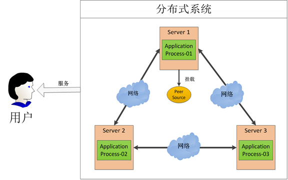

给大家分析一下这张图，在这图中有三台机器，每台机器各跑一个应用程序。然后我们将这三台机器通过网络将其连接起来，构成一个系统来为用户提供服务，对用户来说这个系统的架构是透明的，他感觉不到我这个系统是一个什么样的架构。那么我们就可以把这种系统称作一个分布式系统。

那我们接下来再分析一下，在这个分布式系统中如何对进程进行调度，我假设在第一台机器上挂载了一个资源，然后这三个物理分布的进程都要竞争这个资源，但我们又不希望他们同时进行访问，这时候我们就需要一个协调器，来让他们有序的来访问这个资源。这个协调器就是我们经常提到的那个锁，比如说"进程-1"在使用该资源的时候，会先去获得锁，"进程1"获得锁以后会对该资源保持独占，这样其他进程就无法访问该资源，"进程1"用完该资源以后就将锁释放掉，让其他进程来获得锁，那么通过这个锁机制，我们就能保证了分布式系统中多个进程能够有序的访问该临界资源。那么我们把这个分布式环境下的这个锁叫作分布式锁。这个分布式锁也就是我们分布式协调技术实现的核心内容，那么如何实现这个分布式呢，那就是我们后面要讲的内容。

## **二、分布式锁的实现**
好我们知道，为了防止分布式系统中的多个进程之间相互干扰，我们需要一种分布式协调技术来对这些进程进行调度。而这个分布式协调技术的核心就是来实现这个分布式锁。那么这个锁怎么实现呢？这实现起来确实相对来说比较困难的。

在看了图1.1所示的分布式环境之后，有人可能会感觉这不是很难。无非是将原来在同一台机器上对进程调度的原语，通过网络实现在分布式环境中。是的，表面上是可以这么说。但是问题就出在网络这，在分布式系统中，所有在同一台机器上的假设都不存在：因为网络是不可靠的。

比如，在同一台机器上，你对一个服务的调用如果成功，那就是成功，如果调用失败，比如抛出异常那就是调用失败。但是在分布式环境中，由于网络的不可靠，你对一个服务的调用失败了并不表示一定是失败的，可能是执行成功了，但是响应返回的时候失败了。还有，A和B都去调用C服务，在时间上 A还先调用一些，B后调用，那么最后的结果是不是一定A的请求就先于B到达呢？ 这些在同一台机器上的种种假设，我们都要重新思考，我们还要思考这些问题给我们的设计和编码带来了哪些影响。还有，在分布式环境中为了提升可靠性，我们往往会部署多套服务，但是如何在多套服务中达到一致性，这在同一台机器上多个进程之间的同步相对来说比较容易办到，但在分布式环境中确实一个大难题。

所以分布式协调远比在同一台机器上对多个进程的调度要难得多，而且如果为每一个分布式应用都开发一个独立的协调程序。一方面，协调程序的反复编写浪费，且难以形成通用、伸缩性好的协调器。另一方面，协调程序开销比较大，会影响系统原有的性能。所以，急需一种高可靠、高可用的通用协调机制来用以协调分布式应用。

## **1.2 分布式锁的实现者**

目前，在分布式协调技术方面做得比较好的就是Google的Chubby还有Apache的ZooKeeper他们都是分布式锁的实现者。有人会问既然有了Chubby为什么还要弄一个ZooKeeper，难道Chubby做得不够好吗？不是这样的，主要是Chbby是非开源的，Google自家用。后来雅虎模仿Chubby开发出了ZooKeeper，也实现了类似的分布式锁的功能，并且将ZooKeeper作为一种开源的程序捐献给了Apache，那么这样就可以使用ZooKeeper所提供锁服务。而且在分布式领域久经考验，它的可靠性，可用性都是经过理论和实践的验证的。所以我们在构建一些分布式系统的时候，就可以以这类系统为起点来构建我们的系统，这将节省不少成本，而且bug也 将更少。


## **三、ZooKeeper概述**

ZooKeeper是一种为分布式应用所设计的高可用、高性能且一致的开源协调服务，它提供了一项基本服务：分布式锁服务。由于ZooKeeper的开源特性，后来我们的开发者在分布式锁的基础上，摸索了出了其他的使用方法：配置维护、组服务、分布式消息队列、分布式通知/协调等。

***
**注意：**ZooKeeper**性能上的特点**决定了它能够用在大型的、分布式的系统当中。从**可靠性**方面来说，它并不会因为一个节点的错误而崩溃。除此之外，它**严格的序列访问控制**意味着复杂的控制原语可以应用在客户端上。ZooKeeper在一致性、可用性、容错性的保证，也是ZooKeeper的成功之处，它获得的一切成功都与它采用的协议——Zab协议是密不可分的，这些内容将会在后面介绍。
___

前面提到了那么多的服务，比如分布式锁、配置维护、组服务等，那它们是如何实现的呢，我相信这才是大家关心的东西。ZooKeeper在实现这些服务时，首先它设计一种新的数据结构——Znode，然后在该数据结构的基础上定义了一些原语，也就是一些关于该数据结构的一些操作。有了这些数据结构和原语还不够，因为我们的ZooKeeper是工作在一个分布式的环境下，我们的服务是通过消息以网络的形式发送给我们的分布式应用程序，所以还需要一个通知机制——Watcher机制。那么总结一下，ZooKeeper所提供的服务主要是通过：数据结构+原语+watcher机制，三个部分来实现的。那么我就从这三个方面，给大家介绍一下ZooKeeper。

## **四、ZooKeeper数据模型**
****

### **4.1 ZooKeeper数据模型Znode**
ZooKeeper拥有一个层次的命名空间，这个和标准的文件系统非常相似，如下图3.1 所示。

                  图1.5 ZooKeeper数据模型与文件系统目录树
 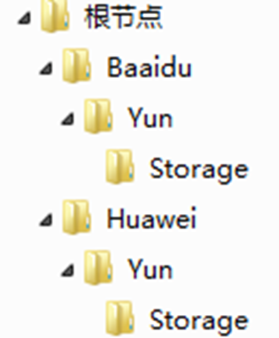

从图中我们可以看出ZooKeeper的数据模型，在结构上和标准文件系统的非常相似，都是采用这种树形层次结构，ZooKeeper树中的每个节点被称为—Znode。和文件系统的目录树一样，ZooKeeper树中的每个节点可以拥有子节点。但也有不同之处：

(1) 引用方式
Zonde通过路径引用，如同Unix中的文件路径。路径必须是绝对的，因此他们必须由斜杠字符来开头。除此以外，他们必须是唯一的，也就是说每一个路径只有一个表示，因此这些路径不能改变。在ZooKeeper中，路径由Unicode字符串组成，并且有一些限制。字符串"/zookeeper"用以保存管理信息，比如关键配额信息。

(2) Znode结构
ZooKeeper命名空间中的Znode，兼具文件和目录两种特点。既像文件一样维护着数据、元信息、ACL、时间戳等数据结构，又像目录一样可以作为路径标识的一部分。图中的每个节点称为一个Znode。 每个Znode由3部分组成:
① stat：此为状态信息, 描述该Znode的版本, 权限等信息
② data：与该Znode关联的数据
③ children：该Znode下的子节点

ZooKeeper虽然可以关联一些数据，但并没有被设计为常规的数据库或者大数据存储，相反的是，它用来管理调度数据，比如分布式应用中的配置文件信息、状态信息、汇集位置等等。这些数据的共同特性就是它们都是很小的数据，通常以KB为大小单位。ZooKeeper的服务器和客户端都被设计为严格检查并限制每个Znode的数据大小至多1M，但常规使用中应该远小于此值。

(3) 数据访问
ZooKeeper中的每个节点存储的数据要被原子性的操作。也就是说读操作将获取与节点相关的所有数据，写操作也将替换掉节点的所有数据。另外，每一个节点都拥有自己的ACL(访问控制列表)，这个列表规定了用户的权限，即限定了特定用户对目标节点可以执行的操作。

(4) 节点类型
ZooKeeper中的节点有两种，分别为临时节点和永久节点。节点的类型在创建时即被确定，并且不能改变。
① 临时节点：该节点的生命周期依赖于创建它们的会话。一旦会话(Session)结束，临时节点将被自动删除，当然可以也可以手动删除。虽然每个临时的Znode都会绑定到一个客户端会话，但他们对所有的客户端还是可见的。另外，ZooKeeper的临时节点不允许拥有子节点。
② 永久节点：该节点的生命周期不依赖于会话，并且只有在客户端显示执行删除操作的时候，他们才能被删除。

(5) 顺序节点
当创建Znode的时候，用户可以请求在ZooKeeper的路径结尾添加一个递增的计数。这个计数对于此节点的父节点来说是唯一的，它的格式为"%10d"(10位数字，没有数值的数位用0补充，例如"0000000001")。当计数值大于232-1时，计数器将溢出。

(6) 观察
客户端可以在节点上设置watch，我们称之为监视器。当节点状态发生改变时(Znode的增、删、改)将会触发watch所对应的操作。当watch被触发时，ZooKeeper将会向客户端发送且仅发送一条通知，因为watch只能被触发一次，这样可以减少网络流量。

### **4.2 ZooKeeper中的时间**

ZooKeeper有多种记录时间的形式，其中包含以下几个主要属性：
**(1) Zxid**
致使ZooKeeper节点状态改变的每一个操作都将使节点接收到一个Zxid格式的时间戳，并且这个时间戳全局有序。也就是说，也就是说，每个对节点的改变都将产生一个唯一的Zxid。如果Zxid1的值小于Zxid2的值，那么Zxid1所对应的事件发生在Zxid2所对应的事件之前。实际上，ZooKeeper的每个节点维护者三个Zxid值，为别为：cZxid、mZxid、pZxid。
**①** **cZxid**： 是节点的创建时间所对应的Zxid格式时间戳。
**② mZxid**：是节点的修改时间所对应的Zxid格式时间戳。
实现中Zxid是一个64为的数字，它高32位是epoch用来标识leader关系是否改变，每次一个leader被选出来，它都会有一个 新的epoch。低32位是个**递增计数**。
**(2) 版本号**
对节点的每一个操作都将致使这个节点的版本号增加。每个节点维护着三个版本号，他们分别为：
**① version**：节点数据版本号
**② cversion**：子节点版本号
**③ aversion**：节点所拥有的ACL版本号

### **4.3 ZooKeeper节点属性**
通过前面的介绍，我们可以了解到，一个节点自身拥有表示其状态的许多重要属性

| 属性 | 描述 |
| ----- | ----------------------- |
|   czxid   | 创建节点时的事务ID |
|   mzxid   | 最后修改节点时的事务ID |
|   pzxid    |  表示该节点的子节点列表最后一次修改的事务ID，添加子节点或删除子节点就会影响子节点列表，但是修改子节点的数据内容则不影响该ID                       |
|   ctime    | 创建节点时的时间 |
|   mtime    | 最后修改节点时的时间 |
|   dataVersion    | 节点修改的版本号 |
|   cversion    | 子节点版本号，子节点每次修改版本号加1 |
|   aversion    | 权限版本号，权限每次修改该版本号加1 |
|   dataLength    | 该节点的数据长度 |
|   numChildren    | 该节点拥有子节点的数量 |
|   ephemeraOwner   | 如果此节点为临时节点，值是这个节点拥有者的会话ID否则为0 |


## **五、ZooKeeper服务中操作**
***

在ZooKeeper中有9个基本操作

| 操作 | 描述 |
| ----- | ----------------------- |
|   create   | 创建Znode(父节点必须存在) |
|   delete   | 删除Znode（不存在子节点） |
|   exists   | 验证Znode是否存在并返回它的元数据 |
|   getACL/setACL   | 为Znode获取或者设置ACL |
|   getChildren   | 获取子节点列表 |
|   getData/setData   | 获取和设置Znode节点数据 |
|   sync   | 是客户端的Znode视图和Zookeeper同步 |


更新ZooKeeper操作是有限制的。delete或setData必须明确要更新的Znode的版本号，我们可以调用exists找到。如果版本号不匹配，更新将会失败。

更新ZooKeeper操作是非阻塞式的。因此客户端如果失去了一个更新(由于另一个进程在同时更新这个Znode)，他可以在不阻塞其他进程执行的情况下，选择重新尝试或进行其他操作。

尽管ZooKeeper可以被看做是一个文件系统，但是处于便利，摒弃了一些文件系统地操作原语。因为文件非常的小并且使整体读写的，所以不需要打开、关闭或是寻地的操作。

## **六、Watch触发器**
***

(1) watch概述
ZooKeeper可以为所有的读操作设置watch，这些读操作包括：exists()、getChildren()及getData()。watch事件是一次性的触发器，当watch的对象状态发生改变时，将会触发此对象上watch所对应的事件。watch事件将被异步地发送给客户端，并且ZooKeeper为watch机制提供了有序的一致性保证。理论上，客户端接收watch事件的时间要快于其看到watch对象状态变化的时间。

(2) watch类型
ZooKeeper所管理的watch可以分为两类：
① 数据watch(data  watches)：getData和exists负责设置数据watch
② 子节点watch(child watches)：getChildren负责设置子节watch
我们可以通过操作返回的数据来设置不同的watch：
① getData和exists：返回关于节点的数据信息
② getChildren：返回子节列表

因此
① 一个成功的setData操作将触发Znode的数据watch
② 一个成功的create操作将触发Znode的数据watch以及子节watch
③ 一个成功的delete操作将触发Znode的数据watch以及子节watch
(3) watch注册与处触发

         图 1.6 watch设置操作及相应的触发器如图下图所示：


① exists操作上的watch，在被监视的Znode创建、删除或数据更新时被触发。
② getData操作上的watch，在被监视的Znode删除或数据更新时被触发。在被创建时不能被触发，因为只有Znode一定存在，getData操作才会成功。
③ getChildren操作上的watch，在被监视的Znode的子节点创建或删除，或是这个Znode自身被删除时被触发。可以通过查看watch事件类型来区分是Znode，还是他的子节点被删除：NodeDelete表示Znode被删除，NodeDeletedChanged表示子节点被删除。

Watch由客户端所连接的ZooKeeper服务器在本地维护，因此watch可以非常容易地设置、管理和分派。当客户端连接到一个新的服务器时，任何的会话事件都将可能触发watch。另外，当从服务器断开连接的时候，watch将不会被接收。但是，当一个客户端重新建立连接的时候，任何先前注册过的watch都会被重新注册。

(4) 需要注意的几点
Zookeeper的watch实际上要处理两类事件：
① 连接状态事件(type=None, path=null)
这类事件不需要注册，也不需要我们连续触发，我们只要处理就行了。
② 节点事件
节点的建立，删除，数据的修改。它是one time trigger，我们需要不停的注册触发，还可能发生事件丢失的情况。
上面2类事件都在Watch中处理，也就是重载的process(Event event)
节点事件的触发，通过函数exists，getData或getChildren来处理这类函数，有双重作用：
① 注册触发事件
② 函数本身的功能
函数的本身的功能又可以用异步的回调函数来实现,重载processResult()过程中处理函数本身的的功能。


## **七、ZooKeeper应用举例**
****

为了方便大家理解ZooKeeper，在此就给大家举个例子，看看ZooKeeper是如何实现的他的服务的，我以ZooKeeper提供的基本服务分布式锁为例。

### **7.1 分布式锁应用场景**
***

在分布式锁服务中，有一种最典型应用场景，就是通过对集群进行Master选举，来解决分布式系统中的单点故障。什么是分布式系统中的单点故障：通常分布式系统采用主从模式，就是一个主控机连接多个处理节点。主节点负责分发任务，从节点负责处理任务，当我们的主节点发生故障时，那么整个系统就都瘫痪了，那么我们把这种故障叫作单点故障。如下图1.7和1.8所示：

图1.7 主从模式分布式系统 


图1.8 单点故障
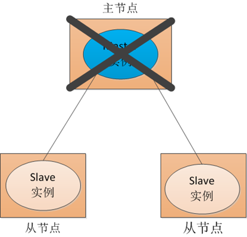

### **7.2 传统解决方案**
***

传统方式是采用一个备用节点，这个备用节点定期给当前主节点发送ping包，主节点收到ping包以后向备用节点发送回复Ack，当备用节点收到回复的时候就会认为当前主节点还活着，让他继续提供服务。如图1.9所示：

图 1.9传统解决方案
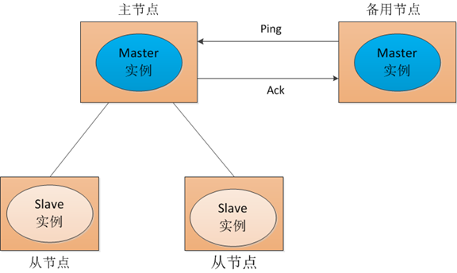

当主节点挂了，这时候备用节点收不到回复了，然后他就认为主节点挂了接替他成为主节点如下图1.10所示：

图 1.10传统解决方案

但是这种方式就是有一个隐患，就是网络问题，来看一网络问题会造成什么后果，如下图1.11所示：

图 1.11 网络故障
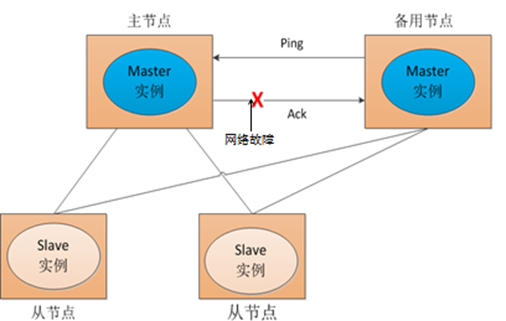

也就是说我们的主节点的并没有挂，只是在回复的时候网络发生故障，这样我们的备用节点同样收不到回复，就会认为主节点挂了，然后备用节点将他的Master实例启动起来，这样我们的分布式系统当中就有了两个主节点也就是双Master，出现Master以后我们的从节点就会将它所做的事一部分汇报给了主节点，一部分汇报给了从节点，这样服务就全乱了。为了防止出现这种情况，我们引入了ZooKeeper，它虽然不能避免网络故障，但它能够保证每时每刻只有一个Master。我么来看一下ZooKeeper是如何实现的。

### **7.3 ZooKeeper解决方案**
***

(1) Master启动
在引入了Zookeeper以后我们启动了两个主节点，"主节点-A"和"主节点-B"他们启动以后，都向ZooKeeper去注册一个节点。我们假设"主节点-A"锁注册地节点是"master-00001"，"主节点-B"注册的节点是"master-00002"，注册完以后进行选举，编号最小的节点将在选举中获胜获得锁成为主节点，也就是我们的"主节点-A"将会获得锁成为主节点，然后"主节点-B"将被阻塞成为一个备用节点。那么，通过这种方式就完成了对两个Master进程的调度。

图1.12 ZooKeeper 启动 Master选举


(2) Master故障
如果"主节点-A"挂了，这时候他所注册的节点将被自动删除，ZooKeeper会自动感知节点的变化，然后再次发出选举，这时候"主节点-B"将在选举中获胜，替代"主节点-A"成为主节点。

图1.13 ZooKeeper 故障 Master选举

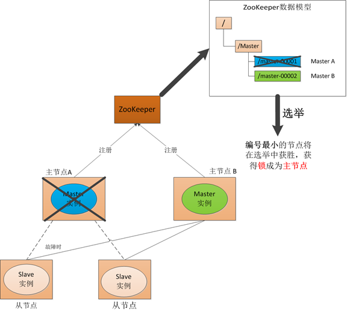

(3) Master 恢复

图1.13 ZooKeeper 恢复 Master选举

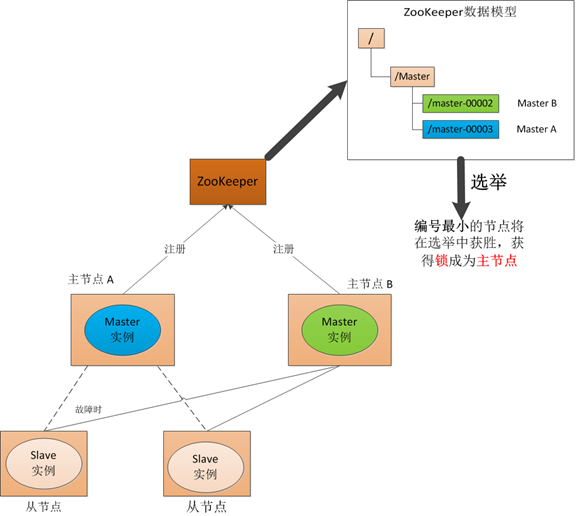

如果主节点恢复了，他会再次向ZooKeeper注册一个节点，这时候他注册的节点将会是"master-00003"，ZooKeeper会感知节点的变化再次发动选举，这时候"主节点-B"在选举中会再次获胜继续担任"主节点"，"主节点-A"会担任备用节点。

***
___

# ZooKeeper安装配置

## **一、Zookeeper的搭建方式**
Zookeeper安装方式有三种，单机模式和集群模式以及伪集群模式。

■ 单机模式：Zookeeper只运行在一台服务器上，适合测试环境；
■ 伪集群模式：就是在一台物理机上运行多个Zookeeper 实例；
■ 集群模式：Zookeeper运行于一个集群上，适合生产环境，这个计算机集群被称为一个“集合体”（ensemble）

Zookeeper通过复制来实现高可用性，只要集合体中半数以上的机器处于可用状态，它就能够保证服务继续。为什么一定要超过半数呢？这跟Zookeeper的复制策略有关：zookeeper确保对znode 树的每一个修改都会被复制到集合体中超过半数的机器上。
### **1.1 Zookeeper的单机模式搭建**
下载ZooKeeper：
[ 百度网盘下载 ](https://pan.baidu.com/s/10beTsARpvXRXx83HEcNwmQ)  提取码：hec9 
解压：tar -zxvf zookeeper-3.4.13.tar.gz
配置文件：在conf目录下删除zoo_sample.cfg文件，创建一个配置文件zoo.cfg。
tickTime=2000
dataDir=E:\\developer\\zookeeper-3.4.13\\data\\server
dataLogDir=E:\\developer\\zookeeper-3.4.13\\logs\\server_log        
clientPort=2181
可以根据自己需要设置环境变量

### **1.2 Zookeeper的伪集群模式搭建**

Zookeeper不但可以在单机上运行单机模式Zookeeper，而且可以在单机模拟集群模式 Zookeeper的运行，也就是将不同节点运行在同一台机器。我们知道伪分布模式下Hadoop的操作和分布式模式下有着很大的不同，但是在集群为分布 式模式下对Zookeeper的操作却和集群模式下没有本质的区别。显然，集群伪分布式模式为我们体验Zookeeper和做一些尝试性的实验提供了很大 的便利。比如，我们在实验的时候，可以先使用少量数据在集群伪分布模式下进行测试。当测试可行的时候，再将数据移植到集群模式进行真实的数据实验。这样不 但保证了它的可行性，同时大大提高了实验的效率。这种搭建方式，比较简便，成本比较低，适合测试和学习，如果你的手头机器不足，就可以在一台机器上部署了 3个server。
#### **1.2.1. 注意事项**
在一台机器上部署了3个server，需要注意的是在集群为分布式模式下我们使用的每个配置文档模拟一台机器，也就是说单台机器及上运行多个Zookeeper实例。但是，必须保证每个配置文档的各个端口号不能冲突，除了clientPort不同之外，dataDir也不同。另外，还要在dataDir所对应的目录中创建myid文件来指定对应的Zookeeper服务器实例。

■ clientPort端口：如果在1台机器上部署多个server，那么每台机器都要不同的 clientPort，比如 server1是2181,server2是2182，server3是2183

■ dataDir和dataLogDir：dataDir和dataLogDir也需要区分下，将数据文件和日志文件分开存放，同时每个server的这两变量所对应的路径都是不同的

■ server.X和myid： server.X 这个数字就是对应，data/myid中的数字。在3个server的myid文件中分别写入了1，2，3，那么每个server中的zoo.cfg都配 server.1 server.2,server.3就行了。因为在同一台机器上，后面连着的2个端口，3个server都不要一样，否则端口冲突

下面是我所配置的集群伪分布模式，分别通过zoo1.cfg、zoo2.cfg、zoo3.cfg来模拟由三台机器的Zookeeper集群,代码清单 zoo1.cfg如下:

```
tickTime=2000

initLimit=10

syncLimit=5

dataDir=E:\\developer\\zookeeper-3.4.13\\data\\server1

dataLogDir=E:\\developer\\zookeeper-3.4.13\\logs\\server1_log

clientPort=2181

#maxClientCnxns=60

#autopurge.snapRetainCount=3

#autopurge.purgeInterval=1

server.1=127.0.0.1:2887:3887

server.2=127.0.0.1:2888:3888

server.3=127.0.0.1:2889:3889

```

代码清单  zoo2.cfg如下:

```
tickTime=2000

initLimit=10

syncLimit=5

dataDir=E:\\developer\\zookeeper-3.4.13\\data\\server2

dataLogDir=E:\\developer\\zookeeper-3.4.13\\logs\\server2_log

clientPort=2182

#maxClientCnxns=60

#autopurge.snapRetainCount=3

#autopurge.purgeInterval=1

server.1=127.0.0.1:2887:3887

server.2=127.0.0.1:2888:3888

server.3=127.0.0.1:2889:3889

```

代码清单 zoo3.cfg如下:

```
tickTime=2000

initLimit=10

syncLimit=5

dataDir=E:\\developer\\zookeeper-3.4.13\\data\\server3

dataLogDir=E:\\developer\\zookeeper-3.4.13\\logs\\server3_log

clientPort=2183

#maxClientCnxns=60

#autopurge.snapRetainCount=3

#autopurge.purgeInterval=1

server.1=127.0.0.1:2887:3887

server.2=127.0.0.1:2888:3888

server.3=127.0.0.1:2889:3889
```

#### **1.2.2 启动**
修改windows 系统下Zookeeper的启动脚本 zkServer.cmd

默认
```
@echo off
REM Licensed to the Apache Software Foundation (ASF) under one or more
REM contributor license agreements.  See the NOTICE file distributed with
REM this work for additional information regarding copyright ownership.
REM The ASF licenses this file to You under the Apache License, Version 2.0
REM (the "License"); you may not use this file except in compliance with
REM the License.  You may obtain a copy of the License at
REM
REM     http://www.apache.org/licenses/LICENSE-2.0
REM
REM Unless required by applicable law or agreed to in writing, software
REM distributed under the License is distributed on an "AS IS" BASIS,
REM WITHOUT WARRANTIES OR CONDITIONS OF ANY KIND, either express or implied.
REM See the License for the specific language governing permissions and
REM limitations under the License.

setlocal
call "%~dp0zkEnv.cmd"

set ZOOMAIN=org.apache.zookeeper.server.quorum.QuorumPeerMain
echo on
call %JAVA% "-Dzookeeper.log.dir=%ZOO_LOG_DIR%" "-Dzookeeper.root.logger=%ZOO_LOG4J_PROP%" -cp "%CLASSPATH%" %ZOOMAIN% "%ZOOCFG%" %*

endlocal
```
修改后,主要是增加一个参数 和最后call 命令的执行
```
@echo off
REM Licensed to the Apache Software Foundation (ASF) under one or more
REM contributor license agreements.  See the NOTICE file distributed with
REM this work for additional information regarding copyright ownership.
REM The ASF licenses this file to You under the Apache License, Version 2.0
REM (the "License"); you may not use this file except in compliance with
REM the License.  You may obtain a copy of the License at
REM
REM     http://www.apache.org/licenses/LICENSE-2.0
REM
REM Unless required by applicable law or agreed to in writing, software
REM distributed under the License is distributed on an "AS IS" BASIS,
REM WITHOUT WARRANTIES OR CONDITIONS OF ANY KIND, either express or implied.
REM See the License for the specific language governing permissions and
REM limitations under the License.

setlocal
call "%~dp0zkEnv.cmd"

set ZOOMAIN=org.apache.zookeeper.server.quorum.QuorumPeerMain
echo on
if "%1%" neq "" (
set ZOOCFG=../conf/%1%
)
call %JAVA% "-Dzookeeper.log.dir=%ZOO_LOG_DIR%" "-Dzookeeper.root.logger=%ZOO_LOG4J_PROP%" -cp "%CLASSPATH%" %ZOOMAIN% "%ZOOCFG%"
REM call %JAVA% "-Dzookeeper.log.dir=%ZOO_LOG_DIR%" "-Dzookeeper.root.logger=%ZOO_LOG4J_PROP%" -cp "%CLASSPATH%" %ZOOMAIN% "%ZOOCFG%" %*
endlocal
```
然后开始分别启动
```
zkServer.cmd zoo1.cfg
zkServer.cmd zoo2.cfg
zkServer.cmd zoo3.cfg
```

启动结果，如下图所示：3个QuorumPeerMain 表示启动成功
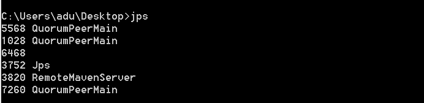

在运行完第一条指令之后，会出现一些错误异常，产生异常信息的原因是由于Zookeeper服务的每个实例都拥有全局配置信息，他们在启动的时候会随时随地的进行Leader选举操作。此时，第一个启动的Zookeeper需要和另外两个Zookeeper实例进行通信。但是，另外两个Zookeeper实例还没有启动起来，因此就产生了这的异样信息。我们直接将其忽略即可，待把图中“2号”和“3号”Zookeeper实例启动起来之后，相应的异常信息自然会消失。

### **1.3  Zookeeper的集群模式搭建**

为了获得可靠地Zookeeper服务，用户应该在一个机群上部署Zookeeper。只要机群上大多数的Zookeeper服务启动了，那么总的Zookeeper服务将是可用的。集群的配置方式，和前两种类似，同样需要进行环境变量的配置。在每台机器上conf/zoo.cf配置文件的参数设置相同

#### **1.3.1 创建myid**
在dataDir(E:\\developer\\zookeeper-3.4.13\\data)目录创建myid文件
Server1机器的内容为：1
Server2机器的内容为：2
Server3机器的内容为：3

#### **1.3.2 编写配置文件**
在conf目录下删除zoo_sample.cfg文件，创建一个配置文件zoo.cfg，如下所示,代码清单  zoo.cfg中的参数设置
```
tickTime=2000

initLimit=10

syncLimit=5

dataDir=E:\\developer\\zookeeper-3.4.13\\data\\server

dataLogDir=E:\\developer\\zookeeper-3.4.13\\logs\\server_log

clientPort=2181

#maxClientCnxns=60

#autopurge.snapRetainCount=3

#autopurge.purgeInterval=1

server.1=host1:2888:3888

server.2=host1:2888:3888

server.3=host1:2888:3888
```

#### **1.3.3 启动**
分别在3台机器上启动ZooKeeper的Server：zkServer.cmd

## **二、Zookeeper的配置**
Zookeeper的功能特性是通过Zookeeper配置文件来进行控制管理的(zoo.cfg).这样的设计其实有其自身的原因，通过前面对Zookeeper的配置可以看出，在对Zookeeper集群进行配置的时候，它的配置文档是完全相同的。集群伪分布模式中，有少部分是不同的。这样的配置方式使得在部署Zookeeper服务的时候非常方便。如果服务器使用不同的配置文件，必须确保不同配置文件中的服务器列表相匹配。

在设置Zookeeper配置文档时候，某些参数是可选的，某些是必须的。这些必须参数就构成了Zookeeper配置文档的最低配置要求。另外，若要对Zookeeper进行更详细的配置，可以参考下面的内容。
下面是在最低配置要求中必须配置的参数：
### **2.1 基本配置**
(1) client：监听客户端连接的端口。
(2) tickTime：基本事件单元，这个时间是作为Zookeeper服务器之间或客户端与服务器之间维持心跳的时间间隔，每隔tickTime时间就会发送一个心跳；最小 的session过期时间为2倍tickTime 　　
dataDir：存储内存中数据库快照的位置，如果不设置参数，更新食物的日志将被存储到默认位置。

应该谨慎的选择日志存放的位置，使用专用的日志存储设备能够大大提高系统的性能，如果将日志存储在比较繁忙的存储设备上，那么将会很大程度上影像系统性能。

### **2.2 高级配置**
下面是高级配置参数中可选配置参数，用户可以使用下面的参数来更好的规定Zookeeper的行为：
(1) dataLogDir
这个操作让管理机器把事务日志写入“dataLogDir”所指定的目录中，而不是“dataDir”所指定的目录。这将允许使用一个专用的日志设备，帮助我们避免日志和快照的竞争。配置如下：
```
# the directory where the snapshot is stored
dataLogDir=E:\\developer\\zookeeper-3.4.13\\logs\\server_log
```

(2) maxClientCnxns

这个操作将限制连接到Zookeeper的客户端数量，并限制并发连接的数量，通过IP来区分不同的客户端。此配置选项可以阻止某些类别的Dos攻击。将他设置为零或忽略不进行设置将会取消对并发连接的限制。
例如，此时我们将maxClientCnxns的值设为1，如下所示：
```
# set maxClientCnxns
  maxClientCnxns=1
```
启动Zookeeper之后，首先用一个客户端连接到Zookeeper服务器上。之后如果有第二个客户端尝试对Zookeeper进行连接，或者有某些隐式的对客户端的连接操作，将会触发Zookeeper的上述配置。

(3) minSessionTimeout和maxSessionTimeout
即最小的会话超时和最大的会话超时时间。在默认情况下，minSession=2*tickTime；maxSession=20*tickTime。

### **2.3 集群配置**
(1) initLimit
此配置表示，允许follower(相对于Leaderer言的“客户端”)连接并同步到Leader的初始化连接时间，以tickTime为单位。当初始化连接时间超过该值，则表示连接失败。

(2) syncLimit
此配置项表示Leader与Follower之间发送消息时，请求和应答时间长度。如果follower在设置时间内不能与leader通信，那么此follower将会被丢弃。

(3) server.A=B：C：D
A：其中 A 是一个数字，表示这个是服务器的编号；
B：是这个服务器的 ip 地址；
C：Zookeeper服务器之间的通信端口；
D：Leader选举的端口。


(4) myid和zoo.cfg
除了修改 zoo.cfg 配置文件，集群模式下还要配置一个文件 myid，这个文件在 dataDir 目录下，这个文件里面就有一个数据就是 A 的值，Zookeeper 启动时会读取这个文件，拿到里面的数据与 zoo.cfg 里面的配置信息比较从而判断到底是那个 server。

# Zookeeper命令操作
## **一、Zookeeper的四字命令**
Zookeeper支持某些特定的四字命令字母与其的交互。他们大多数是查询命令，用来获取Zookeeper服务的当前状态及相关信息。用户在客户端可以通过telnet或nc向Zookeeper提交相应的命令。Zookeeper常用的四字命令见下图所示。


```
telnet 127.0.0.1 2183
stat
    Zookeeper version: 3.4.13-2d71af4dbe22557fda74f9a9b4309b15a7487f03, built on 06/29/2018 04:05 GMT
Clients:
 /127.0.0.1:58307[0](queued=0,recved=1,sent=0)
 /127.0.0.1:56955[1](queued=0,recved=276,sent=276)

Latency min/avg/max: 0/1/112
Received: 282
Sent: 281
Connections: 2                                                           Outstanding: 0                                                           Zxid: 0x200000005                                                       Mode: follower                                                           Node count:11

telnet 127.0.0.1 2183
conf
clientPort=2181
dataDir=E:\developer\zookeeper-3.4.13\data\server1\version-2
dataLogDir=E:\developer\zookeeper-3.4.13\logs\server1_log\version-2
tickTime=2000
maxClientCnxns=60
minSessionTimeout=4000
maxSessionTimeout=40000
serverId=1
initLimit=10
syncLimit=5
electionAlg=3
electionPort=3887
quorumPort=2887
peerType=0


```

## **二、Zookeeper的简单操作**

#### **2.1 Zookeeper命令工具**

```
zkCli.cmd -server 127.0.0.1:2181

```

```
E:\>cd E:\developer\zookeeper-3.4.13\bin
E:\developer\zookeeper-3.4.13\bin>zkCli.cmd -server 127.0.0.1:2181
Connecting to 127.0.0.1:2181
2019-06-23 14:40:16,924 [myid:] - INFO  [main:Environment@100] - Client environment:zookeeper.version=3.4.13-2d71af4dbe2
2557fda74f9a9b4309b15a7487f03, built on 06/29/2018 04:05 GMT
2019-06-23 14:40:16,928 [myid:] - INFO  [main:Environment@100] - Client environment:host.name=windows10.microdone.cn
2019-06-23 14:40:16,929 [myid:] - INFO  [main:Environment@100] - Client environment:java.version=1.8.0_31
2019-06-23 14:40:16,932 [myid:] - INFO  [main:Environment@100] - Client environment:java.vendor=Oracle Corporation
2019-06-23 14:40:16,933 [myid:] - INFO  [main:Environment@100] - Client environment:java.home=C:\Program Files\Java\jdk1
.8.0_31\jre
2019-06-23 14:40:16,935 [myid:] - INFO  [main:Environment@100] - Client environment:java.class.path=E:\developer\zookeep
er-3.4.13\bin\..\build\classes;E:\developer\zookeeper-3.4.13\bin\..\build\lib\*;E:\developer\zookeeper-3.4.13\bin\..\zoo
keeper-3.4.13.jar;E:\developer\zookeeper-3.4.13\bin\..\lib\audience-annotations-0.5.0.jar;E:\developer\zookeeper-3.4.13\
bin\..\lib\jline-0.9.94.jar;E:\developer\zookeeper-3.4.13\bin\..\lib\log4j-1.2.17.jar;E:\developer\zookeeper-3.4.13\bin\
..\lib\netty-3.10.6.Final.jar;E:\developer\zookeeper-3.4.13\bin\..\lib\slf4j-api-1.7.25.jar;E:\developer\zookeeper-3.4.1
3\bin\..\lib\slf4j-log4j12-1.7.25.jar;E:\developer\zookeeper-3.4.13\bin\..\conf
2019-06-23 14:40:16,937 [myid:] - INFO  [main:Environment@100] - Client environment:java.library.path=C:\Program Files\J
ava\jdk1.8.0_31\bin;C:\Windows\Sun\Java\bin;C:\Windows\system32;C:\Windows;E:\developer\python\;E:\developer\python\Scri
pts;E:\developer\python;C:\Windows\system32;C:\Windows;C:\Windows\System32\Wbem;C:\Windows\System32\WindowsPowerShell\v1
.0\;D:\Mysql\mysql-5.6.21\bin;E:\Program Files (x86)\scala\bin;C:\Program Files\Java\jdk1.8.0_31\bin;E:\Program Files\ID
M Computer Solutions\UltraCompare;E:\Program Files\RabbitMQ Server\rabbitmq_server-3.7.4\sbin;E:\apache-maven-3.3.9\bin;
E:\Users\apache-jmeter-4.0\apache-jmeter-4.0\lib\ext\ApacheJMeter_core.jar;E:\Users\apache-jmeter-4.0\apache-jmeter-4.0\
lib\jorphan.jar;E:\nexusserver\nexus-3.12.1-01\bin;C:\Program Files\Git\cmd;E:\Program Files\erl10.3\bin;E:\developer\zo
okeeper-3.4.13\bin;;.
2019-06-23 14:40:16,938 [myid:] - INFO  [main:Environment@100] - Client environment:java.io.tmpdir=C:\Users\adu\AppData\
Local\Temp\
2019-06-23 14:40:16,939 [myid:] - INFO  [main:Environment@100] - Client environment:java.compiler=<NA>
2019-06-23 14:40:16,940 [myid:] - INFO  [main:Environment@100] - Client environment:os.name=Windows 8.1
2019-06-23 14:40:16,941 [myid:] - INFO  [main:Environment@100] - Client environment:os.arch=amd64
2019-06-23 14:40:16,942 [myid:] - INFO  [main:Environment@100] - Client environment:os.version=6.3
2019-06-23 14:40:16,943 [myid:] - INFO  [main:Environment@100] - Client environment:user.name=adu
2019-06-23 14:40:16,944 [myid:] - INFO  [main:Environment@100] - Client environment:user.home=C:\Users\adu
2019-06-23 14:40:16,945 [myid:] - INFO  [main:Environment@100] - Client environment:user.dir=E:\developer\zookeeper-3.4.
13\bin
2019-06-23 14:40:16,949 [myid:] - INFO  [main:ZooKeeper@442] - Initiating client connection, connectString=127.0.0.1:218
1 sessionTimeout=30000 watcher=org.apache.zookeeper.ZooKeeperMain$MyWatcher@531d72ca
Welcome to ZooKeeper!
2019-06-23 14:40:17,046 [myid:] - INFO  [main-SendThread(127.0.0.1:2181):ClientCnxn$SendThread@1029] - Opening socket co
nnection to server 127.0.0.1/127.0.0.1:2181. Will not attempt to authenticate using SASL (unknown error)
2019-06-23 14:40:17,049 [myid:] - INFO  [main-SendThread(127.0.0.1:2181):ClientCnxn$SendThread@879] - Socket connection
established to 127.0.0.1/127.0.0.1:2181, initiating session
JLine support is enabled
2019-06-23 14:40:17,186 [myid:] - INFO  [main-SendThread(127.0.0.1:2181):ClientCnxn$SendThread@1303] - Session establish
ment complete on server 127.0.0.1/127.0.0.1:2181, sessionid = 0x100011e76540000, negotiated timeout = 30000

WATCHER::

WatchedEvent state:SyncConnected type:None path:null
[zk: 127.0.0.1:2181(CONNECTED) 0]
```


#### **2.2 使用Zookeeper命令的简单操作步骤**
(1) 使用ls命令查看当前Zookeeper中所包含的内容：ls /
```
[zk: 127.0.0.1:2181(CONNECTED) 0] ls /
[dubbo, zookeeper]
[zk: 127.0.0.1:2181(CONNECTED) 1]
```
(2) 创建一个新的Znode节点"zk"，以及和它相关字符，执行命令：create /zk 123456

```
[zk: 127.0.0.1:2181(CONNECTED) 1] create /zk 123456
Created /zk
[zk: 127.0.0.1:2181(CONNECTED) 2]
```
(3) 再次使用ls命令来查看现在Zookeeper的中所包含的内容：ls /
```
[zk: 127.0.0.1:2181(CONNECTED) 2] ls /
[dubbo, zk, zookeeper]
[zk: 127.0.0.1:2181(CONNECTED) 3]
```
此时看到，zk节点已经被创建。　

(4) 使用get命令来确认第二步中所创建的Znode是否包含我们创建的字符串，执行命令：get /zk

```
[zk: 127.0.0.1:2181(CONNECTED) 3] get /zk
123456
cZxid = 0x200000003
ctime = Sun Jun 23 14:46:50 CST 2019
mZxid = 0x200000003
mtime = Sun Jun 23 14:46:50 CST 2019
pZxid = 0x200000003
cversion = 0
dataVersion = 0
aclVersion = 0
ephemeralOwner = 0x0
dataLength = 6
numChildren = 0
```
(5) 接下来通过set命令来对zk所关联的字符串进行设置，执行命令：set /zk zhangsan

```
[zk: 127.0.0.1:2181(CONNECTED) 4] set /zk zhangsan
cZxid = 0x200000003
ctime = Sun Jun 23 14:46:50 CST 2019
mZxid = 0x200000004
mtime = Sun Jun 23 14:51:06 CST 2019
pZxid = 0x200000003
cversion = 0
dataVersion = 1
aclVersion = 0
ephemeralOwner = 0x0
dataLength = 8
numChildren = 0
[zk: 127.0.0.1:2181(CONNECTED) 5]
```
(6) 再次使用get命令来查看，上次修改的内容，执行命令：get /zk

```
[zk: 127.0.0.1:2181(CONNECTED) 5] get /zk
zhangsan
cZxid = 0x200000003
ctime = Sun Jun 23 14:46:50 CST 2019
mZxid = 0x200000004
mtime = Sun Jun 23 14:51:06 CST 2019
pZxid = 0x200000003
cversion = 0
dataVersion = 1
aclVersion = 0
ephemeralOwner = 0x0
dataLength = 8
numChildren = 0
```
(7) 下面我们将刚才创建的Znode删除，执行命令：delete /zk
```
[zk: 127.0.0.1:2181(CONNECTED) 6] delete /zk
[zk: 127.0.0.1:2181(CONNECTED) 7]
```

(8) 最后再次使用ls命令查看Zookeeper中的内容，执行命令：ls /

```
[zk: 127.0.0.1:2181(CONNECTED) 7] ls /
[dubbo, zookeeper]
[zk: 127.0.0.1:2181(CONNECTED) 8]
```
### 2.3使用Java API简单操作
同步创建节点
```
import org.apache.zookeeper.CreateMode;
import org.apache.zookeeper.WatchedEvent;
import org.apache.zookeeper.Watcher;
import org.apache.zookeeper.Watcher.Event.KeeperState;
import org.apache.zookeeper.ZooDefs.Ids;
import org.apache.zookeeper.ZooKeeper;

import java.util.concurrent.CountDownLatch;

public class ZookeeperCreateAPISyncUsage implements Watcher {
	private static CountDownLatch connectedSemaphore = new CountDownLatch(1);
	
	public static void main(String[] args) throws Exception {
		ZooKeeper zookeeper = new ZooKeeper("127.0.0.1:2181", 5000, new ZookeeperCreateAPISyncUsage());
		System.out.println(zookeeper.getState());
		connectedSemaphore.await();
		
		String path1 = zookeeper.create("/zk-test-ephemeral-/heheda/fuck", "".getBytes(), Ids.OPEN_ACL_UNSAFE, CreateMode.EPHEMERAL);	
		System.out.println("Success create znode: " + path1);
		
		String path2 = zookeeper.create("/zk-test-ephemeral-", "".getBytes(), Ids.OPEN_ACL_UNSAFE, CreateMode.EPHEMERAL_SEQUENTIAL);	
		System.out.println("Success create znode: " + path2);
		Thread.sleep(Integer.MAX_VALUE);
	}

	public void process(WatchedEvent event) {
		if (KeeperState.SyncConnected == event.getState()) {
			connectedSemaphore.countDown();
		}
	}
}
```
异步获取子节点列表
```
import org.apache.zookeeper.AsyncCallback;
import org.apache.zookeeper.CreateMode;
import org.apache.zookeeper.WatchedEvent;
import org.apache.zookeeper.Watcher;
import org.apache.zookeeper.Watcher.Event.EventType;
import org.apache.zookeeper.Watcher.Event.KeeperState;
import org.apache.zookeeper.ZooDefs.Ids;
import org.apache.zookeeper.ZooKeeper;
import org.apache.zookeeper.data.Stat;

import java.util.List;
import java.util.concurrent.CountDownLatch;

public class ZookeeperGetChildrenAPIASyncUsage implements Watcher {
	private static CountDownLatch connectedSemaphore = new CountDownLatch(1);
	private static ZooKeeper zk = null;

	public static void main(String[] args) throws Exception {
		String path = "/zk-book";
		zk = new ZooKeeper("127.0.0.1:2181", 5000, new ZookeeperGetChildrenAPIASyncUsage());
		connectedSemaphore.await();
		zk.create(path, "".getBytes(), Ids.OPEN_ACL_UNSAFE, CreateMode.PERSISTENT);
		System.out.println("success create znode: " + path);
		zk.create(path + "/c1", "".getBytes(), Ids.OPEN_ACL_UNSAFE, CreateMode.EPHEMERAL);
		System.out.println("success create znode: " + path + "/c1");

		zk.getChildren(path, true, new IChildren2Callback(), null);

		zk.create(path + "/c2", "".getBytes(), Ids.OPEN_ACL_UNSAFE, CreateMode.EPHEMERAL);
		System.out.println("success create znode: " + path + "/c2");

		Thread.sleep(Integer.MAX_VALUE);
	}

	public void process(WatchedEvent event) {
		if (KeeperState.SyncConnected == event.getState()) {
			if (EventType.None == event.getType() && null == event.getPath()) {
				connectedSemaphore.countDown();
			} else if (event.getType() == EventType.NodeChildrenChanged) {
				try {
					System.out.println("ReGet Child:" + zk.getChildren(event.getPath(), true));
				} catch (Exception e) {
				}
			}
		}
	}
}

class IChildren2Callback implements AsyncCallback.Children2Callback {
	public void processResult(int rc, String path, Object ctx, List<String> children, Stat stat) {
		System.out.println("Get Children znode result: [response code: " + rc + ", param path: " + path + ", ctx: "
				+ ctx + ", children list: " + children + ", stat: " + stat);
	}
}
```

```
import org.I0Itec.zkclient.ZkClient;

import java.util.concurrent.TimeUnit;

public class CreateNodeSample {
    public static void main(String[] args) throws Exception {
    	ZkClient zkClient = new ZkClient("127.0.0.1:2181", 5000);
        String path = "/zk-book3/c1";
        zkClient.createPersistent(path, true);
        zkClient.createEphemeral(path+"/c3","123456");
        System.out.println("success create znode.");
        TimeUnit.SECONDS.sleep(Long.MAX_VALUE);
    }
}
```
### 2.4使用开源的客户端访问

#### **2.4.1 ZkClient**
ZkClient是在Zookeeper原声API接口之上进行了包装，是一个更易用的Zookeeper客户端，其内部还实现了诸如Session超时重连、Watcher反复注册等功能。
```
import org.I0Itec.zkclient.ZkClient;

import java.util.concurrent.TimeUnit;

public class CreateNodeSample {
    public static void main(String[] args) throws Exception {
    	ZkClient zkClient = new ZkClient("127.0.0.1:2181", 5000);
        String path = "/zk-book3/c1";
        zkClient.createPersistent(path, true);
        zkClient.createEphemeral(path+"/c3","123456");
        System.out.println("success create znode.");
        TimeUnit.SECONDS.sleep(Long.MAX_VALUE);
    }
}
```
```
import org.I0Itec.zkclient.IZkChildListener;
import org.I0Itec.zkclient.ZkClient;

import java.util.List;

public class GetChildrenSample {

	public static void main(String[] args) throws Exception {
		String path = "/zk-book2";
		ZkClient zkClient = new ZkClient("127.0.0.1:2181", 5000);
		zkClient.subscribeChildChanges(path, new IZkChildListener() {
			public void handleChildChange(String parentPath, List<String> currentChilds) throws Exception {
				System.out.println(parentPath + " 's child changed, currentChilds:" + currentChilds);
			}
		});

		zkClient.createPersistent(path);
		Thread.sleep(1000);
		zkClient.createPersistent(path + "/c2");
		Thread.sleep(1000);
		zkClient.delete(path + "/c2");
		Thread.sleep(1000);
		zkClient.delete(path);
		Thread.sleep(Integer.MAX_VALUE);
	}
}
```


#### **2.4.2 Curator客户端**

Curator解决了很多Zookeeper客户端非常底层的细节开发工作，包括连接重连，反复注册Watcher和NodeExistsException异常等，现已成为Apache的顶级项目。
```
import org.apache.curator.framework.CuratorFramework;
import org.apache.curator.framework.CuratorFrameworkFactory;
import org.apache.curator.framework.api.BackgroundCallback;
import org.apache.curator.framework.api.CuratorEvent;
import org.apache.curator.retry.ExponentialBackoffRetry;
import org.apache.zookeeper.CreateMode;

import java.util.concurrent.CountDownLatch;
import java.util.concurrent.ExecutorService;
import java.util.concurrent.Executors;

public class CreateNodeBackgroundSample {
	static String path = "/zk-book";
	static CuratorFramework client = CuratorFrameworkFactory.builder().connectString("127.0.0.1:2181")
			.sessionTimeoutMs(5000).retryPolicy(new ExponentialBackoffRetry(1000, 3)).build();
	static CountDownLatch semaphore = new CountDownLatch(2);
	static ExecutorService tp = Executors.newFixedThreadPool(2);

	public static void main(String[] args) throws Exception {
		client.start();
		System.out.println("Main thread: " + Thread.currentThread().getName());

		client.create().creatingParentsIfNeeded().withMode(CreateMode.EPHEMERAL).inBackground(new BackgroundCallback() {
			public void processResult(CuratorFramework client, CuratorEvent event) throws Exception {
				System.out.println("event[code: " + event.getResultCode() + ", type: " + event.getType() + "]" + ", Thread of processResult: " + Thread.currentThread().getName());
				System.out.println();
				semaphore.countDown();
			}
		}, tp).forPath(path, "init".getBytes());

		client.create().creatingParentsIfNeeded().withMode(CreateMode.EPHEMERAL).inBackground(new BackgroundCallback() {
			public void processResult(CuratorFramework client, CuratorEvent event) throws Exception {
				System.out.println("event[code: " + event.getResultCode() + ", type: " + event.getType() + "]" + ", Thread of processResult: " + Thread.currentThread().getName());
				semaphore.countDown();
			}
		}).forPath(path, "init".getBytes());

		semaphore.await();
		tp.shutdown();
	}
}
```

```
import org.apache.curator.framework.CuratorFramework;
import org.apache.curator.framework.CuratorFrameworkFactory;
import org.apache.curator.framework.recipes.locks.InterProcessMutex;
import org.apache.curator.retry.ExponentialBackoffRetry;

import java.text.SimpleDateFormat;
import java.util.Date;
import java.util.concurrent.CountDownLatch;

public class RecipesLock {
    static String lock_path = "/curator_recipes_lock_path";
    static CuratorFramework client = CuratorFrameworkFactory.builder().connectString("127.0.0.1:2181")
            .retryPolicy(new ExponentialBackoffRetry(1000, 3)).build();

    public static void main(String[] args) throws Exception {
        client.start();
        final InterProcessMutex lock = new InterProcessMutex(client, lock_path);
        final CountDownLatch down = new CountDownLatch(1);
        for (int i = 0; i < 30; i++) {
            new Thread(new Runnable() {
                public void run() {
                    try {
                        down.await();
                        lock.acquire();
                    } catch (Exception e) {
                    }
                    SimpleDateFormat sdf = new SimpleDateFormat("HH:mm:ss|SSS");
                    String orderNo = sdf.format(new Date());
                    System.out.println(Thread.currentThread().getName() + "生成的订单号是 : " + orderNo);
                    try {
                        lock.release();
                    } catch (Exception e) {
                    }
                }
            }, "Thread-" + (i + 1)).start();
        }
        System.out.println("1111122222222222222222");
        down.countDown();
        System.out.println("3311122222222222222222");
    }
}
```

# ZooKeeper的使用

Zookeeper 作为一个分布式的服务框架，主要用来解决分布式集群中应用系统的一致性问题，它能提供基于类似于文件系统的目录节点树方式的数据存储，但是 Zookeeper 并不是用来专门存储数据的，它的作用主要是用来维护和监控你存储的数据的状态变化。通过监控这些数据状态的变化，从而可以达到基于数据的集群管理，后面将 会详细介绍 Zookeeper 能够解决的一些典型问题。

注意一下这里的"数据"是有限制的：
(1) 从数据大小来看：我们知道ZooKeeper的数据存储在一个叫ReplicatedDataBase 的数据库中，该数据是一个内存数据库，既然是在内存当中，我就应该知道该数据量就应该不会太大，这一点上就与hadoop的HDFS有了很大的区别，HDFS的数据主要存储在磁盘上，因此数据存储主要是HDFS的事，而ZooKeeper主要是协调功能，并不是用来存储数据的。

(2) 从数据类型来看：正如前面所说的，ZooKeeper的数据在内存中，由于内存空间的限制，那么我们就不能在上面随心所欲的存储数据，所以ZooKeeper存储的数据都是我们所关心的数据而且数据量还不能太大，而且还会根据我们要以实现的功能来选择相应的数据。简单来说，干什么事存什么数据，ZooKeeper所实现的一切功能，都是由ZK节点的性质和该节点所关联的数据实现的，至于关联什么数据那就要看你干什么事了。

例如：
　　① 集群管理：利用临时节点特性，节点关联的是机器的主机名、IP地址等相关信息，集群单点故障也属于该范畴。
　　② 统一命名：主要利用节点的唯一性和目录节点树结构。
　　③ 配置管理：节点关联的是配置信息。
　　④ 分布式锁：节点关联的是要竞争的资源。

##  **一、ZooKeeper应用场景**

zooKeeper是一个高可用的分布式数据管理与系统协调框架。基于对Paxos算法的实现，使该框架保证了分布式环境中数据的强一致性，也正是基于这样的特性，使得zookeeper能够应用于很多场景。需要注意的是，ZK并不是生来就为这些场景设计，都是后来众多开发者根据框架的特性，摸索出来的典型使用方法。因此，我们也可以根据自己的需要来设计相应的场景实现。正如前文所提到的，ZooKeeper 实现的任何功能都离不开ZooKeeper的数据结构，任何功能的实现都是利用"Znode结构特性+节点关联的数据"来实现的，好吧那么我们就看一下ZooKeeper数据结构有哪些特性。ZooKeeper数据结构如下图所示：
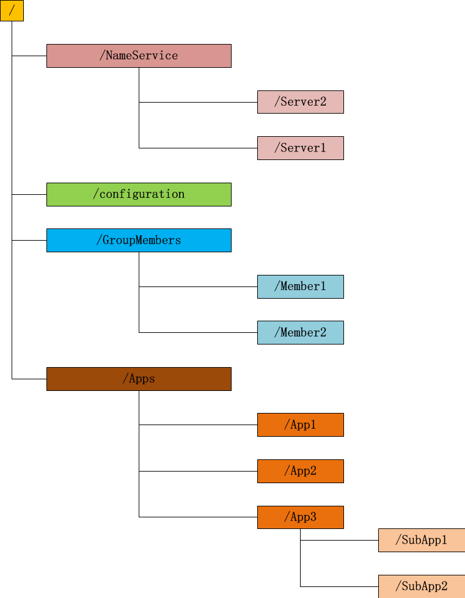

Zookeeper 这种数据结构有如下这些特点：

① 每个子目录项如 NameService 都被称作为 znode，这个 znode 是被它所在的路径唯一标识，如 Server1 这个 znode 的标识为 /NameService/Server1；
② znode 可以有子节点目录，并且每个 znode 可以存储数据，注意 EPHEMERAL 类型的目录节点不能有子节点目录；
③ znode 是有版本的，每个 znode 中存储的数据可以有多个版本，也就是一个访问路径中可以存储多份数据；
④ znode 可以是临时节点，一旦创建这个 znode 的客户端与服务器失去联系，这个 znode 也将自动删除，Zookeeper 的客户端和服务器通信采用长连接方式，每个客户端和服务器通过心跳来保持连接，这个连接状态称为 session，如果 znode 是临时节点，这个 session 失效，znode 也就删除了；
⑤ znode 的目录名可以自动编号，如 App1 已经存在，再创建的话，将会自动命名为 App2；
⑥ znode 可以被监控，包括这个目录节点中存储的数据的修改，子节点目录的变化等，一旦变化可以通知设置监控的客户端，这个是 Zookeeper 的核心特性，Zookeeper 的很多功能都是基于这个特性实现的。

### **1.1数据发布与订阅**
___

#### (1) 典型场景描述
发布与订阅即所谓的配置管理，顾名思义就是将数据发布到ZK节点上，供订阅者动态获取数据，实现配置信息的集中式管理和动态更新。例如全局的配置信息，地址列表等就非常适合使用。集中式的配置管理在应用集群中是非常常见的，一般商业公司内部都会实现一套集中的配置管理中心，应对不同的应用集群对于共享各自配置的需求，并且在配置变更时能够通知到集群中的每一个机器。

#### (2) 应用
① 索引信息和集群中机器节点状态存放在ZK的一些指定节点，供各个客户端订阅使用。
② 系统日志（经过处理后的）存储，这些日志通常2-3天后被清除。
③ 应用中用到的一些配置信息集中管理，在应用启动的时候主动来获取一次，并且在节点上注册一个Watcher，以后每次配置有更新，实时通知到应用，获取最新配置信息。
④ 业务逻辑中需要用到的一些全局变量，比如一些消息中间件的消息队列通常有个offset，这个offset存放在zk上，这样集群中每个发送者都能知道当前的发送进度。
⑤ 系统中有些信息需要动态获取，并且还会存在人工手动去修改这个信息。以前通常是暴露出接口，例如JMX接口，有了ZK后，只要将这些信息存放到ZK节点上即可。

#### (3) 应用举例
例如：同一个应用系统需要多台 PC Server 运行，但是它们运行的应用系统的某些配置项是相同的，如果要修改这些相同的配置项，那么就必须同时修改每台运行这个应用系统的 PC Server，这样非常麻烦而且容易出错。将配置信息保存在 Zookeeper 的某个目录节点中，然后将所有需要修改的应用机器监控配置信息的状态，一旦配置信息发生变化，每台应用机器就会收到 Zookeeper 的通知，然后从 Zookeeper 获取新的配置信息应用到系统中。ZooKeeper配置管理服务如下图所示：

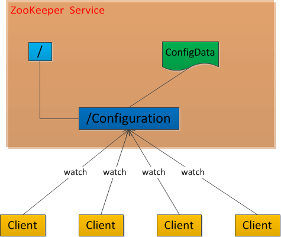

Zookeeper很容易实现这种集中式的配置管理，比如将所需要的配置信息放到/Configuration 节点上，集群中所有机器一启动就会通过Client对/Configuration这个节点进行监控【zk.exist("/Configuration″,true)】，并且实现Watcher回调方法process()，那么在zookeeper上/Configuration节点下数据发生变化的时候，每个机器都会收到通知，Watcher回调方法将会被执行，那么应用再取下数据即可【zk.getData("/Configuration″,false,null)】。

## **1.2统一命名服务（Name Service）**
***
___
##### (1) 场景描述
分布式应用中，通常需要有一套完整的命名规则，既能够产生唯一的名称又便于人识别和记住，通常情况下用树形的名称结构是一个理想的选择，树形的名称结构是一个有层次的目录结构，既对人友好又不会重复。说到这里你可能想到了 JNDI，没错 Zookeeper 的 Name Service 与 JNDI 能够完成的功能是差不多的，它们都是将有层次的目录结构关联到一定资源上，但是Zookeeper的Name Service 更加是广泛意义上的关联，也许你并不需要将名称关联到特定资源上，你可能只需要一个不会重复名称，就像数据库中产生一个唯一的数字主键一样。

##### (2) 应用
在分布式系统中，通过使用命名服务，客户端应用能够根据指定的名字来获取资源服务的地址，提供者等信息。被命名的实体通常可以是集群中的机器，提供的服务地址，进程对象等等，这些我们都可以统称他们为名字（Name）。其中较为常见的就是一些分布式服务框架中的服务地址列表。通过调用ZK提供的创建节点的API，能够很容易创建一个全局唯一的path，这个path就可以作为一个名称。Name Service 已经是Zookeeper 内置的功能，你只要调用 Zookeeper 的 API 就能实现。如调用 create 接口就可以很容易创建一个目录节点。

##### (3) 应用举例
阿里开源的分布式服务框架Dubbo中使用ZooKeeper来作为其命名服务，维护全局的服务地址列表。在Dubbo实现中： 服务提供者在启动的时候，向ZK上的指定节点/dubbo/${serviceName}/providers目录下写入自己的URL地址，这个操作就完成了服务的发布。 服务消费者启动的时候，订阅/dubbo/${serviceName}/providers目录下的提供者URL地址， 并向/dubbo/${serviceName} /consumers目录下写入自己的URL地址。 注意，所有向ZK上注册的地址都是临时节点，这样就能够保证服务提供者和消费者能够自动感应资源的变化。 另外，Dubbo还有针对服务粒度的监控，方法是订阅/dubbo/${serviceName}目录下所有提供者和消费者的信息。

### **1.3分布通知/协调（Distribution of notification/coordination）**
***
___
#### (1) 典型场景描述
ZooKeeper中特有watcher注册与异步通知机制，能够很好的实现分布式环境下不同系统之间的通知与协调，实现对数据变更的实时处理。使用方法通常是不同系统都对ZK上同一个znode进行注册，监听znode的变化（包括znode本身内容及子节点的），其中一个系统update了znode，那么另一个系统能够收到通知，并作出相应处理。

#### (2) 应用
① 另一种心跳检测机制：检测系统和被检测系统之间并不直接关联起来，而是通过ZK上某个节点关联，大大减少系统耦合。
② 另一种系统调度模式：某系统由控制台和推送系统两部分组成，控制台的职责是控制推送系统进行相应的推送工作。管理人员在控制台作的一些操作，实际上是修改了ZK上某些节点的状态，而ZK就把这些变化通知给他们注册Watcher的客户端，即推送系统，于是，作出相应的推送任务。
③ 另一种工作汇报模式：一些类似于任务分发系统，子任务启动后，到ZK来注册一个临时节点，并且定时将自己的进度进行汇报（将进度写回这个临时节点），这样任务管理者就能够实时知道任务进度。
总之，使用zookeeper来进行分布式通知和协调能够大大降低系统之间的耦合。

### **1.4分布式锁（Distribute Lock）**
***
___

#### (1) 场景描述
分布式锁，这个主要得益于ZooKeeper为我们保证了数据的强一致性，即用户只要完全相信每时每刻，zk集群中任意节点（一个zk server）上的相同znode的数据是一定是相同的。锁服务可以分为两类，一个是保持独占，另一个是控制时序。
保持独占，就是所有试图来获取这个锁的客户端，最终只有一个可以成功获得这把锁。通常的做法是把ZK上的一个znode看作是一把锁，通过create znode的方式来实现。所有客户端都去创建 /distribute_lock 节点，最终成功创建的那个客户端也即拥有了这把锁。
控制时序，就是所有试图来获取这个锁的客户端，最终都是会被安排执行，只是有个全局时序了。做法和上面基本类似，只是这里 /distribute_lock 已经预先存在，客户端在它下面创建临时有序节点。Zk的父节点（/distribute_lock）维持一份sequence,保证子节点创建的时序性，从而也形成了每个客户端的全局时序。

#### (2) 应用
共享锁在同一个进程中很容易实现，但是在跨进程或者在不同 Server 之间就不好实现了。Zookeeper 却很容易实现这个功能，实现方式也是需要获得锁的 Server 创建一个 EPHEMERAL_SEQUENTIAL 目录节点，然后调用 getChildren方法获取当前的目录节点列表中最小的目录节点是不是就是自己创建的目录节点，如果正是自己创建的，那么它就获得了这个锁，如果不是那么它就调用 exists(String path, boolean watch) 方法并监控 Zookeeper 上目录节点列表的变化，一直到自己创建的节点是列表中最小编号的目录节点，从而获得锁，释放锁很简单，只要删除前面它自己所创建的目录节点就行了。

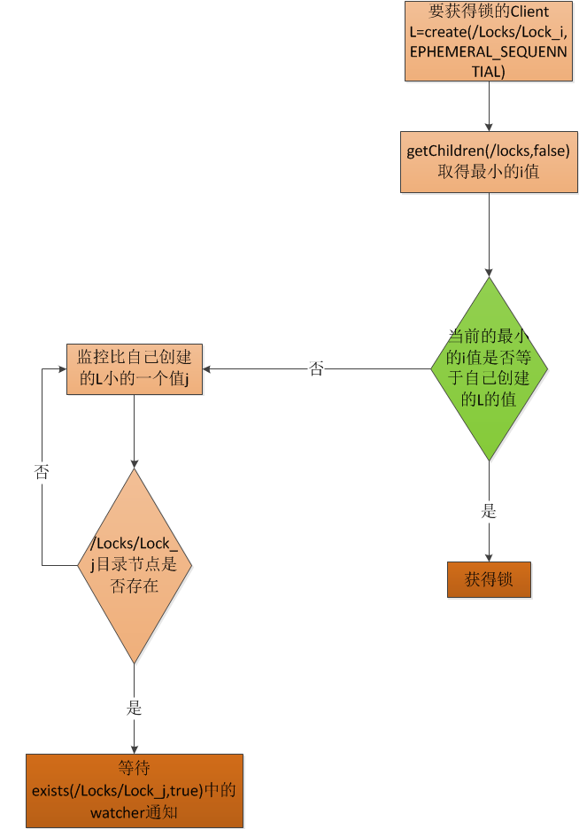

### **1.5 集群管理（Cluster Management）**
***
___

#### (1) 典型场景描述
##### 集群机器监控：
这通常用于那种对集群中机器状态，机器在线率有较高要求的场景，能够快速对集群中机器变化作出响应。这样的场景中，往往有一个监控系统，实时检测集群机器是否存活。过去的做法通常是：监控系统通过某种手段（比如ping）定时检测每个机器，或者每个机器自己定时向监控系统汇报"我还活着"。 这种做法可行，但是存在两个比较明显的问题：
① 集群中机器有变动的时候，牵连修改的东西比较多。
② 有一定的延时。
利用ZooKeeper中两个特性，就可以实施另一种集群机器存活性监控系统：
① 客户端在节点 x 上注册一个Watcher，那么如果 x 的子节点变化了，会通知该客户端。
② 创建EPHEMERAL类型的节点，一旦客户端和服务器的会话结束或过期，那么该节点就会消失。

##### Master选举：
Master选举则是zookeeper中最为经典的使用场景了，在分布式环境中，相同的业务应用分布在不同的机器上，有些业务逻辑，例如一些耗时的计算，网络I/O处，往往只需要让整个集群中的某一台机器进行执行，其余机器可以共享这个结果，这样可以大大减少重复劳动，提高性能，于是这个master选举便是这种场景下的碰到的主要问题。

利用ZooKeeper中两个特性，就可以实施另一种集群中Master选举：
① 利用ZooKeeper的强一致性，能够保证在分布式高并发情况下节点创建的全局唯一性，即：同时有多个客户端请求创建 /Master 节点，最终一定只有一个客户端请求能够创建成功。利用这个特性，就能很轻易的在分布式环境中进行集群选举了。
②另外，这种场景演化一下，就是动态Master选举。这就要用到 EPHEMERAL_SEQUENTIAL类型节点的特性了，这样每个节点会自动被编号。允许所有请求都能够创建成功，但是得有个创建顺序，每次选取序列号最小的那个机器作为Master 。

#### (2) 应用
在搜索系统中，如果集群中每个机器都生成一份全量索引，不仅耗时，而且不能保证彼此间索引数据一致。因此让集群中的Master来迚行全量索引的生成，然后同步到集群中其它机器。另外，Master选丼的容灾措施是，可以随时迚行手动挃定master，就是说应用在zk在无法获取master信息时，可以通过比如http方式，向一个地方获取master。  在Hbase中，也是使用ZooKeeper来实现动态HMaster的选举。在Hbase实现中，会在ZK上存储一些ROOT表的地址和HMaster的地址，HRegionServer也会把自己以临时节点（Ephemeral）的方式注册到Zookeeper中，使得HMaster可以随时感知到各个HRegionServer的存活状态，同时，一旦HMaster出现问题，会重新选丼出一个HMaster来运行，从而避免了HMaster的单点问题的存活状态，同时，一旦HMaster出现问题，会重新选丼出一个HMaster来运行，从而避免了HMaster的单点问题。

#### (3) 应用举例
##### 集群监控：
应用集群中，我们常常需要让每一个机器知道集群中或依赖的其他某一个集群中哪些机器是活着的，并且在集群机器因为宕机，网络断链等原因能够不在人工介入的情况下迅速通知到每一个机器，Zookeeper 能够很容易的实现集群管理的功能，如有多台 Server 组成一个服务集群，那么必须要一个"总管"知道当前集群中每台机器的服务状态，一旦有机器不能提供服务，集群中其它集群必须知道，从而做出调整重新分配服务策略。同样当增加集群的服务能力时，就会增加一台或多台 Server，同样也必须让"总管"知道，这就是ZooKeeper的集群监控功能。

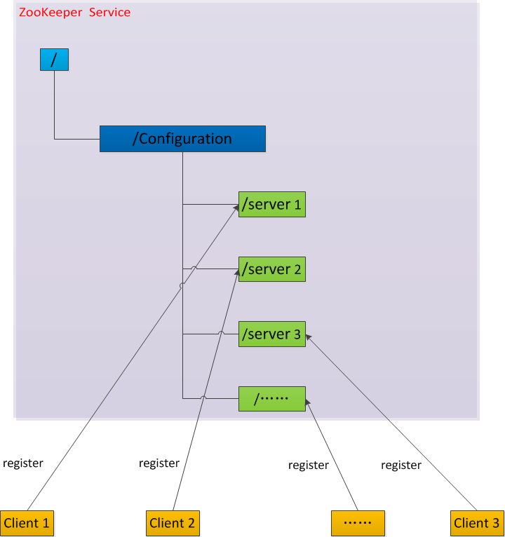

比如我在zookeeper服务器端有一个znode叫/Configuration，那么集群中每一个机器启动的时候都去这个节点下创建一个EPHEMERAL类型的节点，比如server1创建/Configuration /Server1，server2创建/Configuration /Server1，然后Server1和Server2都watch /Configuration 这个父节点，那么也就是这个父节点下数据或者子节点变化都会通知对该节点进行watch的客户端。因为EPHEMERAL类型节点有一个很重要的特性，就是客户端和服务器端连接断掉或者session过期就会使节点消失，那么在某一个机器挂掉或者断链的时候，其对应的节点就会消 失，然后集群中所有对/Configuration进行watch的客户端都会收到通知，然后取得最新列表即可。

##### Master选举：
Zookeeper 不仅能够维护当前的集群中机器的服务状态，而且能够选出一个"总管"，让这个总管来管理集群，这就是 Zookeeper 的另一个功能 Leader Election。Zookeeper 如何实现 Leader Election，也就是选出一个 Master Server。和前面的一样每台 Server 创建一个 EPHEMERAL 目录节点，不同的是它还是一个 SEQUENTIAL 目录节点，所以它是个 EPHEMERAL_SEQUENTIAL 目录节点。之所以它是 EPHEMERAL_SEQUENTIAL 目录节点，是因为我们可以给每台 Server 编号，我们可以选择当前是最小编号的 Server 为 Master，假如这个最小编号的 Server 死去，由于是 EPHEMERAL 节点，死去的 Server 对应的节点也被删除，所以当前的节点列表中又出现一个最小编号的节点，我们就选择这个节点为当前 Master。这样就实现了动态选择 Master，避免了传统意义上单 Master 容易出现单点故障的问题。

### **2.6 队列管理**
***
___

Zookeeper 可以处理两种类型的队列：
① 当一个队列的成员都聚齐时，这个队列才可用，否则一直等待所有成员到达，这种是同步队列。
② 队列按照 FIFO 方式进行入队和出队操作，例如实现生产者和消费者模型。

#### (1) 同步队列用 Zookeeper 实现的实现思路如下：
创建一个父目录 /synchronizing，每个成员都监控标志（Set Watch）位目录 /synchronizing/start 是否存在，然后每个成员都加入这个队列，加入队列的方式就是创建 /synchronizing/member_i 的临时目录节点，然后每个成员获取 / synchronizing 目录的所有目录节点，也就是 member_i。判断 i 的值是否已经是成员的个数，如果小于成员个数等待 /synchronizing/start 的出现，如果已经相等就创建 /synchronizing/start。

用下面的流程图更容易理解：
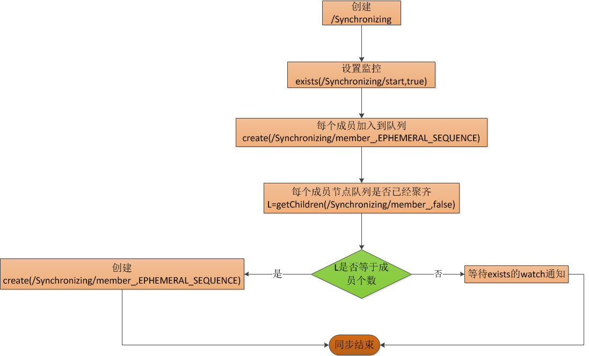


#### (2) FIFO 队列用 Zookeeper 实现思路如下：
实现的思路也非常简单，就是在特定的目录下创建 SEQUENTIAL 类型的子目录 /queue_i，这样就能保证所有成员加入队列时都是有编号的，出队列时通过 getChildren( ) 方法可以返回当前所有的队列中的元素，然后消费其中最小的一个，这样就能保证 FIFO。